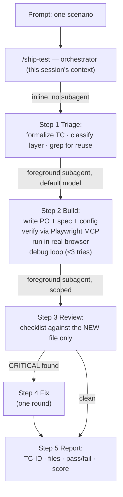
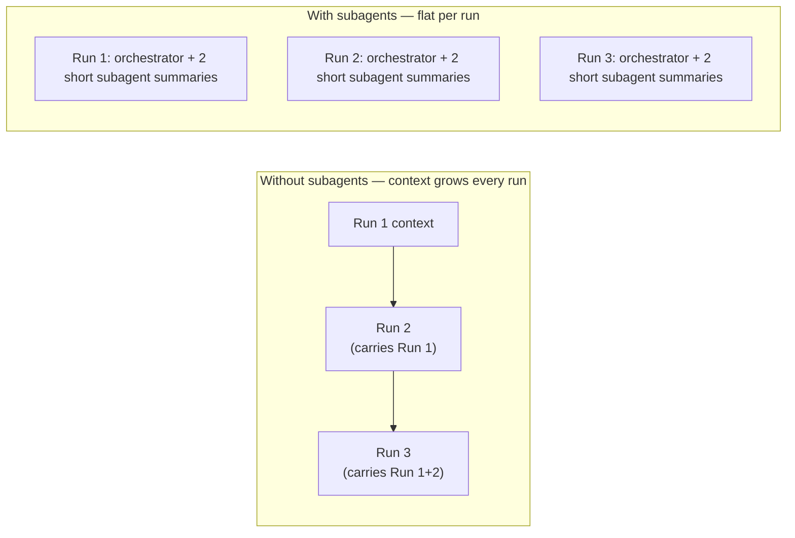

# AI Test Automation Architecture

How a plain-English scenario becomes a passing, reviewed Playwright spec in this
repo — and why it stays cheap and fast as the suite grows.

This repo is a **template, not a project**: nothing in it points at a specific
target app. Every piece below is written to be cloned and pointed at whatever
you're testing next — see §10 for the bootstrap checklist.

> A designed, diagram-first version of this document lives alongside it at
> [`docs/architecture.html`](./architecture.html) — open it in a browser. This
> file is the durable, plain-text copy (GitHub renders the Mermaid diagrams
> below natively). Everything below describes what's **built**; for what's
> proposed but not yet built — self-healing locators, failure triage, CI
> wiring, and more — see [`docs/roadmap.md`](./roadmap.md).

## 1. Two layers, on purpose

| Layer | What it is | Status |
|---|---|---|
| **Execution layer** | The Playwright + TypeScript framework itself: POM, Allure, logging, smoke/regression gate, SauceLabs. Runs tests. Has no opinion about AI, and no opinion about which app it's testing. | Already built (`README.md`) |
| **Authoring layer** | Claude Code skills + Playwright MCP + subagents. Writes the tests that the execution layer runs, using domain knowledge supplied per project (§10). | This document |

Keeping these separate matters: the execution layer works with zero AI involved
(`npm run pw:test`), and the authoring layer only ever produces files that follow
the execution layer's own conventions — it never invents a new pattern. Neither
layer hardcodes an app; both take it as configuration.

## 2. The one-prompt pipeline



Each shaded box after Step 1 is a **separate subagent invocation**, not more
conversation in the same thread. That single choice is most of the token savings —
see §5. Locator-class failures inside Step 2's debug loop are handled by a
dedicated healing procedure rather than blind retries — see §4.

**Guard rail:** Step 1 (and `create-scenarios` directly) checks whether
`app-domain` is still the shipped-empty template before writing anything. A
scenario generated against an empty domain skill is a guess dressed up as a
test — the pipeline stops and asks you to fill it in first rather than produce
that.

## 3. Skill roster

| Skill | Invocation | Reads | Writes |
|---|---|---|---|
| `app-domain` | never directly (`user-invocable: false`) | — | — (ships empty; fill in per project, §10) |
| `playwright-best-practices` | never directly (`user-invocable: false`) | — | — (reference only) |
| `create-scenarios` | `/create-scenarios [feature]` | `app-domain`, existing specs | `docs/test-scenarios.md` |
| `test-strategy` | `/test-strategy [feature]` | `docs/test-scenarios.md`, `app-domain` | `docs/test-strategy.md` |
| `generate-tests` | `/generate-tests [flow]` | best-practices, domain, strategy doc, Playwright MCP | spec + PO + config entry |
| `review-tests` | `/review-tests [file]` | best-practices, the spec(s) under review | `docs/review-report.md` |
| **`ship-test`** | **`/ship-test <scenario>`**, or just paste a scenario | orchestrates the four above via subagents | everything above, end to end |

The two knowledge skills (`app-domain`, `playwright-best-practices`) are marked
`user-invocable: false` deliberately — they're not commands, they're shared
context the other five skills pull in on demand. That keeps them out of the
visible command list while still being reusable from one place instead of copied
into every skill.

`heal-test` isn't in the table above by accident — it's not a pipeline stage,
it's a procedure the pipeline calls into. See §4.

## 4. Self-healing locators

Selector rot — a locator that used to match now matches nothing because the
app changed — is the highest-frequency maintenance cost in any real Playwright
suite. `generate-tests`' Step 5 debug loop routes locator-class failures
(timeout waiting for an element, element not found, strict-mode violation) to
the `heal-test` skill instead of guessing-and-retrying the same selector:

1. Read the failure's **trace** (`trace: "retain-on-failure"` in
   `playwright.config.ts`) — the exact DOM at the moment of failure, no
   re-navigation needed.
2. Re-locate the element by the old locator's *purpose*, not its literal
   string — preferring a new stable identifier, then role + accessible name,
   then label/placeholder text, then visible text — never downgrading to a
   bare positional selector.
3. Judge confidence, then act:

| Confidence | Action |
|---|---|
| High — one unambiguous match | Apply, re-run to confirm, log it |
| Medium — text/label or position-disambiguated match | Apply, re-run to confirm, log it, flag for a human glance |
| Low — multiple candidates or nothing serves the same purpose | Apply nothing. Cross-check `app-domain` — this may be an app bug, not selector rot |

Every applied fix — High or Medium — gets one row in `docs/healing-log.md`
(spec/PO, old locator, new locator, confidence, reason). No silent fixes: a
bad auto-heal needs to be traceable, not discovered by accident. Low
confidence never auto-applies, on purpose — see the guardrail list in
`docs/roadmap.md`.

`heal-test` is also callable standalone (`/heal-test <spec>`) against a
previously-passing spec that starts failing later, independent of the
authoring pipeline — that's the maintenance use case, not just the
authoring-time one.

## 5. Why subagents, not one long conversation

Running all four stages inline, in this same conversation, means every stage's
"knowledge sources" reads (`app-domain`, `playwright-best-practices`, existing
specs, existing page objects) pile up in context — and **stay there** for every
`/ship-test` call after it in the same session. Ten scenarios in one session would
mean the tenth one pays for the reading done by the previous nine.

Delegating steps 2 and 3 to subagents (via the `Agent` tool) means:

- Each subagent gets a **fresh context**, reads only what its step needs, and
  returns a short summary — not its full transcript.
- This orchestrator's own context stays roughly the same size no matter how many
  scenarios get shipped in one session.
- Step 2's real-browser debug loop (which can burn several MCP round-trips
  chasing a flaky selector) is contained inside that subagent instead of
  bloating the thread everyone else's context is measured against.



**Named, tool-restricted agents, not just a generic spawn.** Steps 2 and 3
run as `test-builder` and `test-reviewer` (`.claude/agents/*.md`) rather than
the built-in `general-purpose` type. The distinction that matters:
`test-reviewer`'s tool list has no `Edit` and no `Bash` — it is *structurally*
incapable of modifying the code it reviews or running anything, not just
instructed not to. "Review proposes, it doesn't silently rewrite" (§9,
`docs/roadmap.md`'s guardrail list) is enforced at the tool-permission layer
for this role, not only in the prompt. `test-builder` has no `Agent` tool, so
the chain stays flat — two hops, never a tree of subagents spawning further
subagents. Both personas point at the same skill files
(`generate-tests`/`review-tests`/`heal-test`) as their process definition
rather than re-describing it, for the same reason the Copilot prompt files do
(§12) — one process, however many drivers or roles read it.

## 6. Model tiering

| Step | Work | Model |
|---|---|---|
| 1. Triage | Template-fill a TC block, one-line layer call, grep for reuse | inline, no separate call |
| 2. Build | Selector verification, code generation, real-browser debugging | default (Sonnet) — never downgrade |
| 3. Review | Checklist match against best practices | default, scoped to the new file — pass `--fast` for a cheaper model when speed matters more than a second opinion |
| 4. Fix | Same as Build | default |

The rule of thumb: **downgrade scope before downgrading model.** Scoping review to
one file instead of the whole suite is a safe, large token cut; scoping the model
down risks missing the issue the review exists to catch. Model downgrade stays an
opt-in flag, not a default.

## 7. MCP wiring

`.mcp.json` (project root, git-shareable) registers Playwright MCP for Claude Code
itself — this was previously only wired into `.vscode/mcp.json`, which VS Code's
own MCP client reads, not Claude Code:

```json
{
  "mcpServers": {
    "playwright": {
      "command": "npx",
      "args": ["@playwright/mcp@latest", "--headed"]
    }
  }
}
```

First use in a new terminal session will prompt to approve this project's MCP
server — approve it once. Drop `--headed` for unattended/CI use.

**MCP discipline** (the other half of keeping this fast): take one snapshot per
page to build the selector map, verify only the elements the scenario touches,
then write the Page Object from that. Re-snapshotting the full accessibility tree
after every single action is the single most common way an MCP-driven build
burns through tokens for no benefit.

## 8. Token & speed levers — summary

| Lever | Where |
|---|---|
| Subagent-per-stage context isolation | `ship-test` steps 2–3 |
| Inline fast-path for scenario + layer classification | `ship-test` step 1 |
| Grep/glob for reuse, never a full-folder read | `ship-test` step 1, `generate-tests` |
| One example file to mirror, not "read all existing specs" | `ship-test` step 2 |
| Structural determinism — copy the known-good skeleton, vary only the specifics | `playwright-best-practices` §3–4 |
| One MCP snapshot per page, not one per action | `ship-test` step 2 |
| Review scoped to the new file, not the whole suite | `ship-test` step 3 |
| Model downgrade as an opt-in flag, not a default | `ship-test` steps 1 &amp; 3 |

## 9. One-shot vs manual mode

- **One scenario in, one passing spec out** → `/ship-test <scenario>` (or just
  paste the scenario — the skill auto-triggers on scenario-shaped prompts).
- **Batch work / full control over one stage** → the four skills individually,
  in order: `/create-scenarios` → `/test-strategy` → `/generate-tests` →
  `/review-tests`.

Both paths write to the same files (`docs/test-scenarios.md`,
`docs/test-strategy.md`, `playwright/e2e/`, `playwright/support/pageObjects/`), so
they can be mixed freely — e.g. batch-generate scenarios for a whole feature with
`/create-scenarios`, then ship them one at a time with `/ship-test TC-014`.

## 10. Bootstrapping a new project

Everything above is inert until these are done — nothing in the repo points at
an app until you point it:

1. Copy `.env.example` → `.env`, set `BASE_URL` (+ `APP_USER`/`APP_PASSWORD` if
   the app has a login).
2. Fill in every section of `.claude/skills/app-domain/SKILL.md` — app
   overview, user flows, business rules, data models. This is the file every
   skill in §3 reads first, and the one the guard rail in §2 checks for.
3. Login flow → adapt the selectors already marked for editing in
   `playwright/support/commonFunctions/loginLogout.ts` and
   `playwright/support/auth/example.setup.ts`. No login → delete the
   `auth/` setup pair and its project entry in `playwright.config.ts`.
4. Replace `playwright/support/pageObjects/home-po.ts` and
   `playwright/e2e/example.spec.ts` with your first real page/spec, or keep
   them as the smoke-test baseline.
5. Run `/ship-test <a scenario describing the app's first flow>` and let the
   pipeline take it from there.

The same checklist lives in `CLAUDE.md`, which Claude Code reads automatically
at session start — this copy is here so the architecture document stays
self-contained.

## 11. CI &amp; failure triage

Everything through §10 runs when a human types a command. This section is
what runs on its own: `.github/workflows/playwright.yml`, three layers, none
of them a hard dependency on the ones above.

```
pull_request  ─┬─▶ test (windows-latest, smoke)     ─┬─▶ review           (changed specs → PR comment, AI, optional)
               │                                      │
schedule/manual┴─▶ test (windows-latest, regression) ─┼─▶ triage-baseline  (evidence → PR comment / tracked issue, no AI)
                                                       └─▶ triage           (enriches triage-baseline's post, AI, optional)
```

- **`test`** is deterministic — `npm run pw:test[:smoke]`, nothing AI about
  it, runs regardless of secrets. It runs on `windows-latest` on purpose: the
  logging path (`C:\LogFolder\...`) and Allure teardown are Windows-specific
  by design (§7, `CLAUDE.md`) — this matches local dev rather than working
  around it.
- **`triage-baseline`** runs whenever `test` fails, needs no AI vendor, and
  posts the raw evidence — failing test names, an `out.txt` excerpt, links to
  the uploaded Allure/trace artifacts — as a PR comment, or (for a nightly
  run with no PR to comment on) a tracked GitHub issue labeled
  `needs-triage`, reused across nights rather than duplicated. This is the
  value floor: CI produces a real signal with **no AI vendor configured
  anywhere**.
- **`review`** (optional, AI) runs `review-tests` against exactly the
  spec/PO files changed in the PR (the same file-scoping discipline as §8)
  and posts the result as a PR comment.
- **`triage`** (optional, AI) runs only when `test` fails, downloads that
  run's Allure results and raw traces, and hands them to `triage-failure` —
  which classifies the failure (selector rot → `heal-test`, test bug →
  `generate-tests`, app bug → filed and left untouched, flake → flagged,
  never silently dismissed) — then appends its verdict to whatever
  `triage-baseline` already posted (same PR comment thread, or the same
  tracked issue) rather than starting a second, disconnected conversation.

Both AI jobs require `ANTHROPIC_API_KEY` as a repo secret and are gated on it
being present (`secrets.ANTHROPIC_API_KEY != ''`) — missing it skips them
cleanly rather than failing the build, and `triage-baseline` has already
posted something useful either way. Both AI jobs also run with
`continue-on-error: true` on the Claude Code invocation itself: an AI job that
fails to run is a missed comment, never a red PR check by itself — the same
"CI auto-comments, it doesn't auto-merge" guardrail from `docs/roadmap.md`
applies here at the workflow level, not just in the skill instructions.

## 12. Driving from Copilot instead of Claude Code

Nothing through §11 requires Claude Code specifically except the `.claude/
skills/*` file format itself and the two `claude -p` calls in CI. Everything
else — the framework, `.mcp.json`/`.vscode/mcp.json`, the process each
pipeline stage follows — has no Anthropic dependency baked in. §12 is what
makes that explicit for a second driver: GitHub Copilot in VS Code.

**One process, two drivers.** The two knowledge files — `app-domain` and
`playwright-best-practices` — and the seven pipeline-stage process
definitions stay exactly where they are, in `.claude/skills/*/SKILL.md`
(that's Claude Code's own auto-discovery folder; moving them would break its
pipeline for no benefit). Every Copilot-facing file added for this is a
**thin pointer** at those same definitions, not a rewrite:

```
.github/copilot-instructions.md          →  repo-wide, mirrors CLAUDE.md
.github/instructions/*.instructions.md   →  path-scoped conventions (specs, page objects)
.github/prompts/<name>.prompt.md  ──────▶  "Follow .claude/skills/<name>/SKILL.md" + Copilot-specific mechanics
```

One `*.prompt.md` per pipeline stage (`create-scenarios`, `test-strategy`,
`generate-tests`, `review-tests`, `heal-test`, `triage-failure`, `ship-test`),
invoked as `/name` in Copilot Chat's Agent mode — the same commands, same
file outputs, same conventions as the Claude Code skills they point at. Edit
the process once, in `.claude/skills/`, and both tools follow the update; a
prompt file that duplicated the content instead would drift the moment either
copy got edited without the other.

Real-browser verification works from either driver because it was already
wired for both: `.mcp.json` registers Playwright MCP for Claude Code,
`.vscode/mcp.json` registers the same server for VS Code's own MCP client —
Copilot's Agent mode already had tool access before any file in this section
existed.

**Where the parity isn't perfect:** `ship-test`'s Build and Review steps run
as isolated Claude Code subagents for the context-isolation reasons in §5 —
that specific mechanism doesn't have a direct Copilot equivalent as of this
writing. Driven from Copilot, the same five steps run sequentially in one
chat instead; the process and file outputs are identical, the token-isolation
benefit in §5 just doesn't apply to that path yet.

**Where CI fits:** §11's `triage-baseline` job already produces a real signal
with zero AI vendor configured — that was built provider-agnostic, not
Copilot-specific, on the same principle as this section. GitHub's Copilot
coding agent (assign-to-`@copilot` on an issue) is a real option for picking
up the issue `triage-baseline` files on a nightly failure, but it's
issue-driven and asynchronous, not a scriptable "run this step in this job"
call the way `claude -p` is — so it's a manual assignment, not automated in
the workflow.
