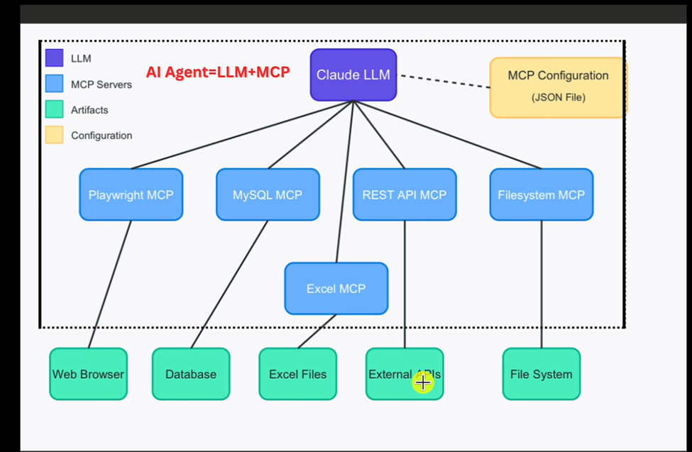
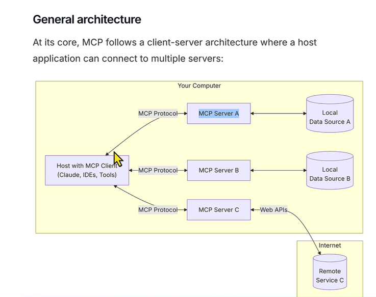

# <span style="color:#0B7285;"><strong>AI Agent = LLM + MCP — Complete In-Depth Explanation</strong></span>



---

## <span style="color:#364FC7;"><strong>1) Paina Diagram Lo Entundi? — Big Picture</strong></span>

Ee diagram oka **AI Agent** ela work avutundo chupistundi.

Simple ga cheppalante:

> **AI Agent = LLM (Brain) + MCP Servers (Hands & Tools)**

LLM ante **Large Language Model** — idi AI ki brain laaga work chesthundi. Think chesthundi, decide chesthundi.

MCP ante **Model Context Protocol** — idi AI ki tools/hands laaga work chesthundi. Real world lo actions chesthundi.

<p><span style="color:#C92A2A;"><strong>Key Formula:</strong></span> <strong>AI Agent = LLM + MCP</strong> — brain + tools = complete agent.</p>

---

## <span style="color:#5F3DC4;"><strong>2) Claude LLM — The Brain (Purple Box)</strong></span>

Diagram lo top lo **Claude LLM** (purple box) undi.

Claude = Anthropic company develop chesina LLM.

Idi chesthundi:
- User request ni **understand** chesthundi
- Ee request ki **which tool use cheyyali** ani decide chesthundi
- Tool nundi result vachinappudu **response generate** chesthundi

**Real life analogy:**

> Manager laaga think cheyyi. Manager ki chala team members untaru (MCP servers). Manager order chesthadu, team execute chestundi.

Claude = Manager 🧠
MCP Servers = Team Members 🤝

---

## <span style="color:#2B8A3E;"><strong>3) MCP Configuration (JSON File) — Yellow Box</strong></span>

Diagram lo right side lo **MCP Configuration (JSON File)** undi. Idi dashed line tho Claude tho connect ayyindi.

Ee JSON file lo **Claude ki cheppuntundi**:
- Ee MCP servers available unnay
- Vallu ela connect avvali
- Which port, which command use cheyyali

**Example JSON structure:**

```json
{
  "mcpServers": {
    "playwright": {
      "command": "npx",
      "args": ["@playwright/mcp"]
    },
    "mysql": {
      "command": "node",
      "args": ["mysql-mcp-server.js"]
    },
    "filesystem": {
      "command": "npx",
      "args": ["@modelcontextprotocol/server-filesystem", "C:/learnAi"]
    }
  }
}
```

<p><span style="color:#E67700;"><strong>Important:</strong></span> Ee configuration file chudukuni Claude tanu use cheyyagalige tools enti ani telusukuntundi. Configuration lo lekapothe, aa tool Claude ki kaladu.</p>

---

## <span style="color:#0B7285;"><strong>4) MCP Servers — The Tools (Blue Boxes)</strong></span>

Diagram lo middle lo **4 MCP Servers** unnay (light blue boxes). Claude direct ga veetitho matladutundi.

### <strong>4a) Playwright MCP</strong>

**Playwright** = Web browser automation tool.

Ee MCP tho Claude chesthundi:
- Web browser open cheyyatam
- Websites visit cheyyatam
- Buttons click cheyyatam
- Forms fill cheyyatam
- Screenshots teeyatam
- Web scraping cheyyatam

**Example use case:**
> "Amazon lo iPhone price enti?" ani user adigite, Claude Playwright MCP use chesi browser lo Amazon open chesi price teesukuntundi.

**Artifact:** → **Web Browser** (green box)

---

### <strong>4b) MySQL MCP</strong>

**MySQL** = Database management.

Ee MCP tho Claude chesthundi:
- Database lo data read cheyyatam
- New records insert cheyyatam
- Data update/delete cheyyatam
- SQL queries run cheyyatam

**Example use case:**
> "Users table lo total entha mandhi unnaru?" ani adigite, Claude MySQL MCP use chesi `SELECT COUNT(*) FROM users;` run chesi answer chepthundi.

**Artifact:** → **Database** (green box)

---

### <strong>4c) REST API MCP</strong>

**REST API** = External services tho communicate cheyyatam.

Ee MCP lo two branches unnay:

#### Excel MCP (sub-branch)
- Excel files create cheyyatam
- Data ni Excel lo write cheyyatam
- Excel sheets read cheyyatam

**Artifacts:**
- → **Excel Files** (green box)
- → **External APIs** (green box)

**Example use case:**
> "Weather data teesukondi Excel lo save cheyyi" ani adigite:
> 1. REST API MCP → Weather API call chestundi (External APIs)
> 2. Excel MCP → aa data ni Excel file lo save chestundi (Excel Files)

---

### <strong>4d) Filesystem MCP</strong>

**Filesystem** = Computer lo files/folders manage cheyyatam.

Ee MCP tho Claude chesthundi:
- Files create cheyyatam
- Files read cheyyatam
- Files edit cheyyatam
- Folders browse cheyyatam
- Content save cheyyatam

**Example use case:**
> "Ee explanation ni oka file lo save cheyyi" ani adigite, Claude Filesystem MCP use chesi `learningExplaination` file create chestundi — exactly mana ippudu chestunnatu!

**Artifact:** → **File System** (green box)

---

## <span style="color:#364FC7;"><strong>5) Artifacts — The Real World (Green Boxes)</strong></span>

Diagram lo bottom lo **5 green boxes** unnay. Ee green boxes = **Real World Resources** — actual ga use ayyeve items.

| Green Box | Meaning | Which MCP Uses It |
|-----------|---------|-------------------|
| **Web Browser** | Actual Chrome/Firefox browser | Playwright MCP |
| **Database** | MySQL, PostgreSQL database | MySQL MCP |
| **Excel Files** | .xlsx files on computer | Excel MCP |
| **External APIs** | Weather API, Maps API, etc. | REST API MCP |
| **File System** | Computer folders & files | Filesystem MCP |

<p><span style="color:#C92A2A;"><strong>Key Point:</strong></span> MCP servers oka middleman laaga work chestay — Claude ki direct ga filesystem or browser touch cheyyatam possible kaadu, so MCP servers aa bridge provide chestay.</p>

---

## <span style="color:#5F3DC4;"><strong>6) Full Flow — Oka Complete Example Tho Artham Cheskondaam</strong></span>

**User Request:** "Naa company database nundi top 5 customers teesukondi, vallu data ni Excel file lo save cheyyi, and oka confirmation email send cheyyi."

**Ee request ki Claude ela respond chesthundi:**

```
Step 1: User request Claude ki vastundi
         ↓
Step 2: Claude MCP Configuration chudutundi
        → MySQL MCP available undi ✓
        → Excel MCP available undi ✓
        → REST API MCP available undi ✓
         ↓
Step 3: Claude → MySQL MCP ki instruction istundi
        "SELECT * FROM customers ORDER BY revenue DESC LIMIT 5;"
         ↓
Step 4: MySQL MCP → Database ki connect avutundi
        → Top 5 customers data teesukuntundi
        → Result Claude ki returns chesthundi
         ↓
Step 5: Claude → Excel MCP ki instruction istundi
        "Ee data ni customers_report.xlsx lo save cheyyi"
         ↓
Step 6: Excel MCP → Excel file create chestundi
        → Data ni write chesthundi
        → Confirmation Claude ki returns chesthundi
         ↓
Step 7: Claude → REST API MCP ki instruction istundi
        "Email API call cheyyi — confirmation mail send cheyyi"
         ↓
Step 8: REST API MCP → External Email API call chesthundi
        → Email send avutundi
         ↓
Step 9: Claude → User ki final response chepthundi
        "Top 5 customers data Excel lo save chesanu, email kuda send chesanu!"
```

---

## <span style="color:#2B8A3E;"><strong>7) Why MCP? — Direct ga Claude cheyyadam ledu ela?</strong></span>

Good question! Claude LLM oka **text model** — idi text input teesukoni text output istundi.

Claude **direct ga**:
- Browser open cheyyaledu ❌
- Database connect cheyyaledu ❌
- Files create cheyyaledu ❌
- APIs call cheyyaledu ❌

So **MCP servers** oka bridge ga work chestay:

```
Claude (text instructions) → MCP Server (executes in real world) → Result back to Claude
```

**Analogy:**
> Nuvvu oka manager — nuvvu directly factory machine operate cheyyalevu. Kani nuvvu workers ki (MCP) instructions istav, vaalu machine operate chestaru, result niku cheppistaru.

---

## <span style="color:#E67700;"><strong>8) Legend — Color Codes Artham</strong></span>

Diagram lo top-left lo oka legend undi:

| Color | Meaning |
|-------|---------|
| 🟣 **Purple** | LLM — AI Brain (Claude) |
| 🔵 **Blue** | MCP Servers — Tool Executors |
| 🟢 **Green** | Artifacts — Real World Resources |
| 🟡 **Yellow** | Configuration — Setup Files |

---

## <span style="color:#C92A2A;"><strong>9) Summary — Chala Short ga Gurtupettukovalante</strong></span>

```
AI Agent = LLM (Brain) + MCP Servers (Tools)

Claude LLM:
  → Think chesthundi
  → Decide chesthundi
  → Instructions istundi

MCP Servers (middlemen):
  → Playwright → Web Browser control
  → MySQL → Database operations
  → REST API → External APIs + Excel files
  → Filesystem → Computer files manage

Artifacts (real world):
  → Web Browser, Database, Excel Files, External APIs, File System

Configuration (JSON):
  → Claude ki available tools chepthundi
```

<p><span style="color:#364FC7;"><strong>Final Thought:</strong></span> MCP oka standard protocol — different companies different MCP servers build cheyyachu, and Claude (or any LLM) vaatanni use cheyyadam possible. Idi AI ni real world tho connect chese bridge.</p>

---

*Ee file lo screenshot diagram + complete Telugu-English explanation unnayi.*


---
---

# <span style="color:#0B7285;"><strong>MCP General Architecture — Complete In-Depth Explanation</strong></span>



---

## <span style="color:#364FC7;"><strong>1) Ee Diagram Cheppedi Enti? — Big Picture</strong></span>

Ee diagram **MCP (Model Context Protocol)** yokka official **General Architecture** chupistundi.

Official definition:

> "At its core, MCP follows a **client-server architecture** where a **host application** can connect to **multiple servers**."

Simple ga cheppalante:

- Oka **Host** (Claude, IDEs, Tools) untundi — idi client side
- Aa host **multiple MCP Servers** tho connect avutundi — A, B, C
- Prathi MCP Server oka **data source** ki connect avutundi — local files or internet services

**Analogy:**
> Oka office manager (Host) ki chala assistants (MCP Servers) untaru. Prathi assistant oka specific department (Data Source) tho matladataniki responsible.

---

## <span style="color:#5F3DC4;"><strong>2) Host with MCP Client — Left Side Box</strong></span>

Diagram lo **left side** lo oka box undi:

```
Host with MCP Client
(Claude, IDEs, Tools)
```

### Host ante enti?

**Host** = MCP use chese application.

Examples:
- **Claude** — Anthropic AI chatbot
- **IDEs** — VS Code, Cursor, etc.
- **Tools** — Any custom application

### MCP Client ante enti?

Host lo **built-in** ga oka MCP Client untundi. Idi MCP Servers tho communicate cheyyatam handle chesthundi.

```
Host Application
    └── MCP Client (built-in)
            ├── connects to MCP Server A
            ├── connects to MCP Server B
            └── connects to MCP Server C
```

<p><span style="color:#C92A2A;"><strong>Key Point:</strong></span> Host = application. MCP Client = aa application lo unna connector part. Rendu separate kaadu — oka daani lona oka part.</p>

---

## <span style="color:#2B8A3E;"><strong>3) MCP Protocol — The Communication Language</strong></span>

Diagram lo arrows meeda **"MCP Protocol"** ani raasiundi. Idi **Host ↔ MCP Server** madhya communication channel.

MCP Protocol = oka standard language/format lo messages exchange cheyyatam.

**Why standard protocol?**

Standard lekapothe:
- Prathi LLM company own format rasukuntundi
- Prathi tool developer aa format ki match avvadam kastha avutundi
- Compatibility problems vastay

Standard unte:
- Okasari MCP Server build chesthe, **any MCP-compatible host** use cheyyachu
- Claude use cheyyachu, VS Code use cheyyachu, any tool use cheyyachu

**Real life analogy:**
> USB port laaga think cheyyi. USB standard undadam valla, oka cable **any laptop, phone, charger** tho work avutundi. MCP kuda same — oka standard protocol, any compatible host or server.

### Protocol Communication Flow:

```
Host (Claude)
    ↓  "MCP Protocol" (request)
MCP Server A
    ↓  executes action
Data Source A
    ↓  returns data
MCP Server A
    ↓  "MCP Protocol" (response)
Host (Claude)
    ↓
User ki answer
```

---

## <span style="color:#0B7285;"><strong>4) MCP Server A — Local Data Source A</strong></span>

```
MCP Protocol → MCP Server A → Local Data Source A
```

### MCP Server A

MCP Server A oka **locally running process** — nee computer meede run avutundi.

Idi chesthundi:
- Host nundi instruction receive chestundi
- Local Data Source A tho interact chestundi
- Result ni Host ki returns chestundi

### Local Data Source A ante enti?

**Local** = nee computer lo undedi.

Examples:
- Local files (C:\Documents\report.txt)
- Local database (SQLite file)
- Local folder structure

**Example scenario:**
> Claude ki "C:\learnAi folder lo files list cheyyi" ani adigite:
> - Host (Claude) → MCP Protocol → MCP Server A (Filesystem MCP)
> - MCP Server A → Local Data Source A (File System)
> - Files list → back to Claude

---

## <span style="color:#5F3DC4;"><strong>5) MCP Server B — Local Data Source B</strong></span>

```
MCP Protocol → MCP Server B → Local Data Source B
```

Server A laagene, Server B kuda **locally running** — kani idi **different data source** handle chesthundi.

### Why multiple local servers?

Okే server anni cheyyadam possible, kani **separation of concerns** kosam different servers use chestaru:

| Server | Purpose |
|--------|---------|
| MCP Server A | File system access |
| MCP Server B | Local MySQL database |

Each server oka specific job chesthundi — clean and organized.

**Example scenario:**
> Claude ki "Database lo users table show cheyyi" ani adigite:
> - Host (Claude) → MCP Protocol → MCP Server B (MySQL MCP)
> - MCP Server B → Local Data Source B (MySQL Database)
> - Query result → back to Claude

---

## <span style="color:#E67700;"><strong>6) MCP Server C — Web APIs → Remote Service C (Internet)</strong></span>

Ee part diagram lo most interesting!

```
MCP Protocol → MCP Server C ← Web APIs → Remote Service C (Internet)
```

### MCP Server C

Server C kuda nee computer meede run avutundi, kani idi **internet services** tho connect avutundi.

### Web APIs arrow

Diagram lo **"Web APIs"** arrow Server C ki vastundi. Idi cheppedi:

MCP Server C oka **external Web API** call chesthundi → aa API **internet lo** unna Remote Service C tho matladutundi.

### Remote Service C — Internet box

Diagram lo **bottom-right** lo oka separate "Internet" box undi. Daanilo **Remote Service C** (database cylinder shape) undi.

**Remote Service C examples:**
- OpenWeather API (weather data)
- Google Maps API (location data)
- GitHub API (code repositories)
- Stripe API (payment data)
- Any external REST API

### Flow:

```
Claude
  ↓ MCP Protocol
MCP Server C (running on Your Computer)
  ↓ Web API call (HTTP request)
Internet
  ↓
Remote Service C (external server)
  ↓ API response
MCP Server C
  ↓ MCP Protocol
Claude
  ↓
User ki answer
```

**Example scenario:**
> "Current weather in Hyderabad enti?" ani adigite:
> - Claude → MCP Server C (REST API MCP)
> - MCP Server C → OpenWeather API (Web API call)
> - Internet → OpenWeather servers (Remote Service C)
> - Weather data → back through chain → Claude

<p><span style="color:#C92A2A;"><strong>Key Difference:</strong></span> Server A and B = Local only. Server C = Internet tho connect avutundi.</p>

---

## <span style="color:#364FC7;"><strong>7) "Your Computer" Boundary — Yellow Box</strong></span>

Diagram lo **entire top section** oka yellow box lo undi — label: **"Your Computer"**.

Ee boundary cheppedi:

- **Host with MCP Client** → Your Computer lo runs
- **MCP Server A, B, C** → Your Computer lo runs
- **Local Data Source A, B** → Your Computer lo stored

**Only Remote Service C** → Internet lo undi, Your Computer outside.

### Why important?

**Security perspective:**
- Local servers nee computer lo run avutaay — internet expose kaadu
- Only Server C specific ga external call chesthundi
- Nee data **Your Computer** boundary daakalee safe ga untundi

**Performance perspective:**
- Local calls → fast (milliseconds)
- Internet calls → comparatively slow (network latency)

---

## <span style="color:#2B8A3E;"><strong>8) Client-Server Architecture — Deep Dive</strong></span>

MCP **client-server architecture** follow chesthundi. Ee concept software engineering lo very fundamental.

### Traditional Client-Server:

```
Client (browser)  ←→  Server (website backend)
```

### MCP Client-Server:

```
MCP Client (inside Host)  ←→  MCP Servers (A, B, C)
```

### Key properties:

**1. One-to-Many:**
> Oka host **multiple servers** tho same time lo connect avutundi. Diagram lo chupinchina laaga — oka Host box nundi 3 servers ki arrows unnay.

**2. Independent Servers:**
> Prathi MCP Server **independently** run avutundi. Server A crash aite Server B affected kaadu.

**3. Pluggable:**
> New MCP Server add cheyyataniki host code change cheyyakkarledu — just configuration update chesthundi (JSON file, previous diagram lo chupinchinatu).

**4. Standard Protocol:**
> Any language lo MCP Server build cheyyachu (Python, Node.js, Go, etc.) — as long as MCP Protocol follow chesthe work avutundi.

---

## <span style="color:#C92A2A;"><strong>9) Both Diagrams Combination — Complete Picture</strong></span>

Ippudu rendu diagrams chusam — veetini combine cheste:

**Diagram 1 (Previous):** High-level view — Claude + specific MCP servers (Playwright, MySQL, etc.)

**Diagram 2 (This one):** Architecture view — How MCP protocol works internally

```
┌─────────────────────────────────────────┐
│             Your Computer               │
│                                         │
│  ┌──────────────────┐                   │
│  │  Host (Claude)   │                   │
│  │  + MCP Client    │                   │
│  └────────┬─────────┘                   │
│           │                             │
│    ┌──────┼──────┐                      │
│    ↓      ↓      ↓    (MCP Protocol)    │
│  Svr A  Svr B  Svr C                   │
│    ↓      ↓      ↓                      │
│  Local  Local  Web API                  │
│  Files   DB     ↓                       │
│                Internet                 │
│                 ↓                       │
└─────────────────────────────────────────┘
                Remote Services
```

---

## <span style="color:#5F3DC4;"><strong>10) Summary — Ee Diagram Nundi Key Takeaways</strong></span>

```
MCP Architecture = Client-Server Pattern

Host (Claude/IDE/Tool)
  → MCP Client tho equipped
  → Multiple MCP Servers tho connect avutundi
  → MCP Protocol use chesi communicate chesthundi

MCP Servers (A, B, C):
  → Nee computer lo run avutay
  → Local data sources access chestay (files, databases)
  → OR Internet services access chestay (Web APIs)

Data Sources:
  → Local: Files, Databases — Your Computer lo
  → Remote: External APIs, Cloud services — Internet lo

Key Benefits:
  → Standard protocol — any host, any server compatibility
  → Pluggable — new servers add cheyyatam easy
  → Secure — local boundary maintain avutundi
  → Scalable — servers independently run avutay
```

<p><span style="color:#364FC7;"><strong>Final Understanding:</strong></span> MCP = oka universal adapter. Phone charger ki universal adapter laaga — oka standard tho anni countries lo work chestunattu, MCP tho oka standard tho anni AI hosts and tools work chestay.</p>

---

*Ee section lo MCP General Architecture screenshot + complete Telugu-English explanation unnayi.*


---
---

# <span style="color:#0B7285;"><strong>LLM + Playwright MCP — How They Connect & Work Together</strong></span>

---

## <span style="color:#364FC7;"><strong>1) Mana Workspace Lo Enti Undi? — Setup Overview</strong></span>

Mana **PlayWrightAI** workspace lo already oka file undi:

```
C:\PlayWrightAI\
  └── .vscode\
        └── mcp.json   ← Ee file LLM ki Playwright MCP cheppistundi
```

**mcp.json contents:**

```json
{
  "servers": {
    "playwright": {
      "type": "stdio",
      "command": "npx",
      "args": [
        "@playwright/mcp@latest"
      ]
    }
  },
  "inputs": []
}
```

Ee oka chinna file — kani idi **entire connection** setup chesthundi LLM (Claude) ki Playwright MCP tho.

---

## <span style="color:#5F3DC4;"><strong>2) mcp.json Lo Prathi Field Meaning Enti?</strong></span>

```json
"servers": { ... }
```
→ Ee workspace lo available unna MCP servers anni ikkade define chestam.

```json
"playwright": { ... }
```
→ Ee server ki ichi pettina name. LLM idi "playwright" server ga identify chestundi.

```json
"type": "stdio"
```
→ LLM ↔ MCP Server madhya communication **stdin/stdout** (standard input/output) use chestundi.
→ Antey: LLM text messages type chestundi → MCP server reads → executes → result text lo returns.

```json
"command": "npx"
"args": ["@playwright/mcp@latest"]
```
→ MCP Server **ela start cheyyali** ani cheppindi.
→ VS Code/Claude idi automatically run chestundi: `npx @playwright/mcp@latest`
→ Ee command Playwright MCP server ni start chesthundi background lo.

```json
"inputs": []
```
→ Ee MCP server ki extra user inputs (like API keys, passwords) avasaram ledu — so empty array.

<p><span style="color:#C92A2A;"><strong>Key Point:</strong></span> Nuvvu manually emi start cheyyakkarledu. VS Code workspace open chesthe, LLM activate aite — idi automatically <code>npx @playwright/mcp@latest</code> run chesi server start chesthundi.</p>

---

## <span style="color:#2B8A3E;"><strong>3) Connection Flow — Step by Step Ela Jarigindi?</strong></span>

### Step 1: VS Code Workspace Open

```
Nuvvu C:\PlayWrightAI folder VS Code lo open chestav
        ↓
VS Code .vscode/mcp.json file detect chesthundi
        ↓
"Oh! playwright MCP server configured undi" ani VS Code note chesukuntundi
```

### Step 2: LLM (Claude/Copilot) Activate

```
Chat window lo LLM (Claude) start avutundi
        ↓
LLM mcp.json read chesthundi
        ↓
"playwright" server available ani telusukuntundi
        ↓
VS Code automatically runs:  npx @playwright/mcp@latest
        ↓
Playwright MCP Server background lo start avutundi (oka separate process)
```

### Step 3: Connection Establish

```
LLM process  ←──── stdio ────→  Playwright MCP Server process
(Claude)           (stdin/stdout pipe)   (npx @playwright/mcp@latest)

LLM → "What tools do you have?" (initialization handshake)
MCP → "I have: browser_navigate, browser_click, browser_snapshot, ..."
LLM → "Got it. Ready to use them."
Connection established ✅
```

### Step 4: User Request Vastundi

```
User: "Google.com ki navigate cheyyi and title cheppu"
        ↓
LLM understands the request
        ↓
LLM decides: "browser_navigate tool use cheyyali"
        ↓
LLM → Playwright MCP: { tool: "browser_navigate", url: "https://google.com" }
        ↓
Playwright MCP → Chromium browser open chesthundi
        ↓
google.com load avutundi
        ↓
Playwright MCP → LLM: { success: true, title: "Google" }
        ↓
LLM → User: "Google.com ki navigate chesanu. Page title: 'Google'"
```

---

## <span style="color:#0B7285;"><strong>4) Playwright MCP Available Tools — Complete List</strong></span>

Playwright MCP server start aite, LLM ki ee tools available avutay:

| Tool | Chesthundi |
|------|-----------|
| `browser_navigate` | URL ki navigate cheyyatam |
| `browser_click` | Page lo element click cheyyatam |
| `browser_type` | Input fields lo text type cheyyatam |
| `browser_fill_form` | Form fields fill cheyyatam |
| `browser_snapshot` | Page accessibility snapshot (DOM structure) teeyatam |
| `browser_take_screenshot` | Screenshot teeyatam |
| `browser_hover` | Element meeda mouse hover cheyyatam |
| `browser_select_option` | Dropdown lo option select cheyyatam |
| `browser_press_key` | Keyboard key press cheyyatam (Enter, Tab, etc.) |
| `browser_navigate_back` | Browser back button |
| `browser_wait_for` | Element appear avvadam wait cheyyatam |
| `browser_handle_dialog` | Popups/alerts handle cheyyatam |
| `browser_console_messages` | Browser console messages read cheyyatam |
| `browser_network_requests` | Network requests inspect cheyyatam |
| `browser_evaluate` | JavaScript page lo execute cheyyatam |
| `browser_tabs` | Multiple tabs manage cheyyatam |
| `browser_resize` | Browser window size change cheyyatam |
| `browser_drag` | Drag and drop cheyyatam |
| `browser_file_upload` | File upload cheyyatam |
| `browser_close` | Browser close cheyyatam |

<p><span style="color:#E67700;"><strong>Note:</strong></span> LLM ivi anni automatically know chesthundi — mcp.json configure chesthe server start avutundi, server LLM ki tool list ichestundi. Nuvvu manually tool list cheppakkarledu.</p>

---

## <span style="color:#5F3DC4;"><strong>5) Real World Example — Complete Task Execution</strong></span>

**User Request:** "Flipkart lo iPhone 15 search cheyyi, first result price cheppu, and screenshot teyyi"

**LLM internally ee steps chesthundi:**

#### Step 1: browser_navigate
```json
{
  "tool": "browser_navigate",
  "params": { "url": "https://www.flipkart.com" }
}
```
→ Playwright Flipkart open chesthundi ✅

#### Step 2: browser_snapshot
```json
{
  "tool": "browser_snapshot"
}
```
→ Page structure (DOM) teesukuntundi — search box ela undho chustundi ✅

#### Step 3: browser_click (search box)
```json
{
  "tool": "browser_click",
  "params": { "element": "search input box", "ref": "search-box-id" }
}
```
→ Search box click chesthundi ✅

#### Step 4: browser_type
```json
{
  "tool": "browser_type",
  "params": { "text": "iPhone 15" }
}
```
→ "iPhone 15" type chesthundi ✅

#### Step 5: browser_press_key
```json
{
  "tool": "browser_press_key",
  "params": { "key": "Enter" }
}
```
→ Search execute avutundi ✅

#### Step 6: browser_wait_for
```json
{
  "tool": "browser_wait_for",
  "params": { "text": "iPhone 15" }
}
```
→ Results load avvadam wait chesthundi ✅

#### Step 7: browser_snapshot
```json
{
  "tool": "browser_snapshot"
}
```
→ Results page structure teesukuntundi → price extract chesthundi ✅

#### Step 8: browser_take_screenshot
```json
{
  "tool": "browser_take_screenshot"
}
```
→ Screenshot teyyadam ✅

**LLM → User ki final response:**
> "Flipkart lo iPhone 15 search chesanu. First result price: ₹79,999. Screenshot teesukondi ikkade undi."

---

## <span style="color:#2B8A3E;"><strong>6) stdio Communication — How Messages Actually Travel</strong></span>

`"type": "stdio"` ante LLM and MCP Server **same machine lo** stdin/stdout pipe tho communicate chestay.

```
LLM Process                    Playwright MCP Process
(Claude in VS Code)            (npx @playwright/mcp@latest)
       │                                  │
       │──── stdin (write) ──────────────→│
       │     JSON message:                │
       │     {                            │
       │       "method": "tools/call",    │
       │       "params": {                │
       │         "name": "browser_click", │
       │         "arguments": {...}       │
       │       }                          │
       │     }                            │
       │                                  │ (executes Playwright action)
       │←─── stdout (read) ──────────────│
       │     JSON response:               │
       │     {                            │
       │       "result": {                │
       │         "content": "clicked",    │
       │         "success": true          │
       │       }                          │
       │     }                            │
```

**Why stdio?**
- Fast — no network latency, same machine
- Secure — no external ports open
- Simple — just text pipes

**Alternative type: "sse"** — Server-Sent Events, remote servers ki use avutundi (different machine).

---

## <span style="color:#E67700;"><strong>7) Behind the Scenes — npx @playwright/mcp@latest Ela Work Chesthundi?</strong></span>

VS Code `npx @playwright/mcp@latest` run chessinappudu:

```
1. npx → npm registry lo @playwright/mcp@latest download chesthundi (first time only)
           (cached after first run)

2. MCP Server process start avutundi

3. Server internally Playwright library load chesthundi

4. Chromium browser ready state lo unchutundi (headless by default)

5. stdin listen start chesthundi — LLM nundi instructions kosam wait chesthundi

6. Prathi instruction vasthundi:
   → Playwright API call chesthundi
   → Browser action execute avutundi
   → Result stdout lo write chesthundi
   → LLM result receive chesthundi
```

**Headless mode:**
> By default browser **invisible ga** (no window) run avutundi — background lo work chesthundi. LLM ki real browser window see cheyyatam avasaram ledu.

**Headed mode (visible browser):**
> Args lo `"--headed"` add chesthe browser window visible ga run avutundi:
```json
"args": ["@playwright/mcp@latest", "--headed"]
```

---

## <span style="color:#364FC7;"><strong>8) Why .vscode/mcp.json? — Workspace-Specific Configuration</strong></span>

Ee file `.vscode/` folder lo undi — idi **workspace-specific** configuration.

Meaning:
- **C:\PlayWrightAI** lo open chesthe → Playwright MCP available
- **C:\learnAi** lo open chesthe → Playwright MCP **not available** (unless vaatiki kuda mcp.json undi aithe)

### Benefits:

**Project-specific tools:**
> Prathi project ki different MCP servers configure cheyyachu. Playwright project ki playwright MCP, database project ki MySQL MCP.

**Team sharing:**
> `.vscode/mcp.json` git lo commit chesthe, team lo andhariki same MCP setup automatically vastundi. No manual configuration.

**Version control:**
> `@playwright/mcp@latest` instead of specific version — team lo andhariki always latest version.

---

## <span style="color:#C92A2A;"><strong>9) Complete Architecture — Our Workspace Specific</strong></span>

```
C:\PlayWrightAI Workspace
┌─────────────────────────────────────────────────────┐
│                                                     │
│  VS Code + Claude LLM (Copilot Chat)                │
│       │                                             │
│       │ reads .vscode/mcp.json                      │
│       │                                             │
│       ↓                                             │
│  Starts: npx @playwright/mcp@latest                 │
│       │                                             │
│       │ stdio pipe (stdin/stdout)                   │
│       │                                             │
│       ↓                                             │
│  Playwright MCP Server (background process)         │
│       │                                             │
│       │ uses Playwright library                     │
│       │                                             │
│       ↓                                             │
│  Chromium Browser (headless)                        │
│       │                                             │
│       ↓                                             │
│  Websites, Web Apps, Any URL                        │
│                                                     │
└─────────────────────────────────────────────────────┘
```

**Full request-response cycle:**
```
You (User)
  → Chat lo request type chestav
  → LLM understand chesthundi
  → Playwright MCP tools call chesthundi (via stdio)
  → Playwright browser lo action execute chesthundi
  → Result LLM ki vastundi
  → LLM niku response chepthundi
```

---

## <span style="color:#5F3DC4;"><strong>10) Summary — Anni Points Oka Chota</strong></span>

```
.vscode/mcp.json lo undi:
  → "playwright" server defined
  → type: stdio (same machine communication)
  → command: npx @playwright/mcp@latest (auto-start)

Connection process:
  1. VS Code workspace open → mcp.json detect
  2. npx @playwright/mcp@latest auto-run
  3. LLM ↔ MCP Server stdio pipe establish
  4. LLM available tools list teesukuntundi
  5. User request → LLM → correct tool call → browser action → result

Available tools (20+):
  navigate, click, type, screenshot, snapshot,
  hover, select, press_key, wait_for, evaluate, ...

Communication:
  LLM → JSON message via stdin → MCP Server
  MCP Server → JSON result via stdout → LLM

Key benefit:
  → mcp.json oka chinna file — kani idi
    entire LLM ↔ Browser automation pipeline setup chesthundi
  → No manual server start needed
  → Team share cheskovachu (git commit)
  → Project-specific configuration
```

<p><span style="color:#364FC7;"><strong>Bottom Line:</strong></span> <code>.vscode/mcp.json</code> file undi kaabatti — Claude tana chat lo mee request chudagane, automatic ga browser open chesi, click chesi, type chesi, screenshot tesi, results niku chepthundi. Nuvvu emi setup cheyyakkarledu — file already workspace lo undi! 🚀</p>

---

*Ee section lo LLM → Playwright MCP connection, mcp.json explanation, tools list, real examples anni cover chesam.*
