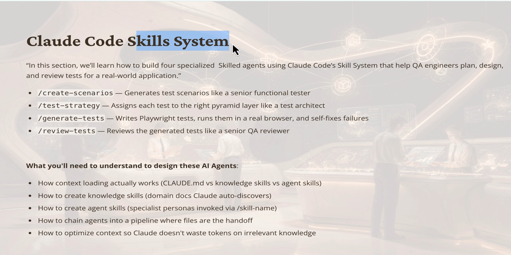

# <span style="color:#0B7285;"><strong>AI Agent = LLM + MCP — Complete In-Depth Explanation</strong></span>


---

## <span style="color:#364FC7;"><strong>1) Paina Diagram Lo Entundi? — Big Picture</strong></span>

Ee diagram oka **AI Agent** ela work avutundo chupistundi.

Simple ga cheppalante:

> **AI Agent = LLM (Brain) + MCP Servers (Hands & Tools)**

LLM ante **Large Language Model** — idi AI ki brain laaga work chesthundi. Think chesthundi, decide chesthundi.

MCP ante **Model Context Protocol** — idi AI ki tools/hands laaga work chesthundi. Real world lo actions chesthundi.

<p><span style="color:#C92A2A;"><strong>Key Formula:</strong></span> <strong>AI Agent = LLM + MCP</strong> — brain + tools = complete agent.</p>

---

## <span style="color:#5F3DC4;"><strong>2) Claude LLM — The Brain (Purple Box)</strong></span>

Diagram lo top lo **Claude LLM** (purple box) undi.

Claude = Anthropic company develop chesina LLM.

Idi chesthundi:
- User request ni **understand** chesthundi
- Ee request ki **which tool use cheyyali** ani decide chesthundi
- Tool nundi result vachinappudu **response generate** chesthundi

**Real life analogy:**

> Manager laaga think cheyyi. Manager ki chala team members untaru (MCP servers). Manager order chesthadu, team execute chestundi.

Claude = Manager 🧠
MCP Servers = Team Members 🤝

---

## <span style="color:#2B8A3E;"><strong>3) MCP Configuration (JSON File) — Yellow Box</strong></span>

Diagram lo right side lo **MCP Configuration (JSON File)** undi. Idi dashed line tho Claude tho connect ayyindi.

Ee JSON file lo **Claude ki cheppuntundi**:
- Ee MCP servers available unnay
- Vallu ela connect avvali
- Which port, which command use cheyyali

**Example JSON structure:**

```json
{
  "mcpServers": {
    "playwright": {
      "command": "npx",
      "args": ["@playwright/mcp"]
    },
    "mysql": {
      "command": "node",
      "args": ["mysql-mcp-server.js"]
    },
    "filesystem": {
      "command": "npx",
      "args": ["@modelcontextprotocol/server-filesystem", "C:/learnAi"]
    }
  }
}
```

<p><span style="color:#E67700;"><strong>Important:</strong></span> Ee configuration file chudukuni Claude tanu use cheyyagalige tools enti ani telusukuntundi. Configuration lo lekapothe, aa tool Claude ki kaladu.</p>

---

## <span style="color:#0B7285;"><strong>4) MCP Servers — The Tools (Blue Boxes)</strong></span>

Diagram lo middle lo **4 MCP Servers** unnay (light blue boxes). Claude direct ga veetitho matladutundi.

### <strong>4a) Playwright MCP</strong>

**Playwright** = Web browser automation tool.

Ee MCP tho Claude chesthundi:
- Web browser open cheyyatam
- Websites visit cheyyatam
- Buttons click cheyyatam
- Forms fill cheyyatam
- Screenshots teeyatam
- Web scraping cheyyatam

**Example use case:**
> "Amazon lo iPhone price enti?" ani user adigite, Claude Playwright MCP use chesi browser lo Amazon open chesi price teesukuntundi.

**Artifact:** → **Web Browser** (green box)

---

### <strong>4b) MySQL MCP</strong>

**MySQL** = Database management.

Ee MCP tho Claude chesthundi:
- Database lo data read cheyyatam
- New records insert cheyyatam
- Data update/delete cheyyatam
- SQL queries run cheyyatam

**Example use case:**
> "Users table lo total entha mandhi unnaru?" ani adigite, Claude MySQL MCP use chesi `SELECT COUNT(*) FROM users;` run chesi answer chepthundi.

**Artifact:** → **Database** (green box)

---

### <strong>4c) REST API MCP</strong>

**REST API** = External services tho communicate cheyyatam.

Ee MCP lo two branches unnay:

#### Excel MCP (sub-branch)
- Excel files create cheyyatam
- Data ni Excel lo write cheyyatam
- Excel sheets read cheyyatam

**Artifacts:**
- → **Excel Files** (green box)
- → **External APIs** (green box)

**Example use case:**
> "Weather data teesukondi Excel lo save cheyyi" ani adigite:
> 1. REST API MCP → Weather API call chestundi (External APIs)
> 2. Excel MCP → aa data ni Excel file lo save chestundi (Excel Files)

---

### <strong>4d) Filesystem MCP</strong>

**Filesystem** = Computer lo files/folders manage cheyyatam.

Ee MCP tho Claude chesthundi:
- Files create cheyyatam
- Files read cheyyatam
- Files edit cheyyatam
- Folders browse cheyyatam
- Content save cheyyatam

**Example use case:**
> "Ee explanation ni oka file lo save cheyyi" ani adigite, Claude Filesystem MCP use chesi `learningExplaination` file create chestundi — exactly mana ippudu chestunnatu!

**Artifact:** → **File System** (green box)

---

## <span style="color:#364FC7;"><strong>5) Artifacts — The Real World (Green Boxes)</strong></span>

Diagram lo bottom lo **5 green boxes** unnay. Ee green boxes = **Real World Resources** — actual ga use ayyeve items.

| Green Box | Meaning | Which MCP Uses It |
|-----------|---------|-------------------|
| **Web Browser** | Actual Chrome/Firefox browser | Playwright MCP |
| **Database** | MySQL, PostgreSQL database | MySQL MCP |
| **Excel Files** | .xlsx files on computer | Excel MCP |
| **External APIs** | Weather API, Maps API, etc. | REST API MCP |
| **File System** | Computer folders & files | Filesystem MCP |

<p><span style="color:#C92A2A;"><strong>Key Point:</strong></span> MCP servers oka middleman laaga work chestay — Claude ki direct ga filesystem or browser touch cheyyatam possible kaadu, so MCP servers aa bridge provide chestay.</p>

---

## <span style="color:#5F3DC4;"><strong>6) Full Flow — Oka Complete Example Tho Artham Cheskondaam</strong></span>

**User Request:** "Naa company database nundi top 5 customers teesukondi, vallu data ni Excel file lo save cheyyi, and oka confirmation email send cheyyi."

**Ee request ki Claude ela respond chesthundi:**

```
Step 1: User request Claude ki vastundi
         ↓
Step 2: Claude MCP Configuration chudutundi
        → MySQL MCP available undi ✓
        → Excel MCP available undi ✓
        → REST API MCP available undi ✓
         ↓
Step 3: Claude → MySQL MCP ki instruction istundi
        "SELECT * FROM customers ORDER BY revenue DESC LIMIT 5;"
         ↓
Step 4: MySQL MCP → Database ki connect avutundi
        → Top 5 customers data teesukuntundi
        → Result Claude ki returns chesthundi
         ↓
Step 5: Claude → Excel MCP ki instruction istundi
        "Ee data ni customers_report.xlsx lo save cheyyi"
         ↓
Step 6: Excel MCP → Excel file create chestundi
        → Data ni write chesthundi
        → Confirmation Claude ki returns chesthundi
         ↓
Step 7: Claude → REST API MCP ki instruction istundi
        "Email API call cheyyi — confirmation mail send cheyyi"
         ↓
Step 8: REST API MCP → External Email API call chesthundi
        → Email send avutundi
         ↓
Step 9: Claude → User ki final response chepthundi
        "Top 5 customers data Excel lo save chesanu, email kuda send chesanu!"
```

---

## <span style="color:#2B8A3E;"><strong>7) Why MCP? — Direct ga Claude cheyyadam ledu ela?</strong></span>

Good question! Claude LLM oka **text model** — idi text input teesukoni text output istundi.

Claude **direct ga**:
- Browser open cheyyaledu ❌
- Database connect cheyyaledu ❌
- Files create cheyyaledu ❌
- APIs call cheyyaledu ❌

So **MCP servers** oka bridge ga work chestay:

```
Claude (text instructions) → MCP Server (executes in real world) → Result back to Claude
```

**Analogy:**
> Nuvvu oka manager — nuvvu directly factory machine operate cheyyalevu. Kani nuvvu workers ki (MCP) instructions istav, vaalu machine operate chestaru, result niku cheppistaru.

---

## <span style="color:#E67700;"><strong>8) Legend — Color Codes Artham</strong></span>

Diagram lo top-left lo oka legend undi:

| Color | Meaning |
|-------|---------|
| 🟣 **Purple** | LLM — AI Brain (Claude) |
| 🔵 **Blue** | MCP Servers — Tool Executors |
| 🟢 **Green** | Artifacts — Real World Resources |
| 🟡 **Yellow** | Configuration — Setup Files |

---

## <span style="color:#C92A2A;"><strong>9) Summary — Chala Short ga Gurtupettukovalante</strong></span>

```
AI Agent = LLM (Brain) + MCP Servers (Tools)

Claude LLM:
  → Think chesthundi
  → Decide chesthundi
  → Instructions istundi

MCP Servers (middlemen):
  → Playwright → Web Browser control
  → MySQL → Database operations
  → REST API → External APIs + Excel files
  → Filesystem → Computer files manage

Artifacts (real world):
  → Web Browser, Database, Excel Files, External APIs, File System

Configuration (JSON):
  → Claude ki available tools chepthundi
```

<p><span style="color:#364FC7;"><strong>Final Thought:</strong></span> MCP oka standard protocol — different companies different MCP servers build cheyyachu, and Claude (or any LLM) vaatanni use cheyyadam possible. Idi AI ni real world tho connect chese bridge.</p>

---

*Ee file lo screenshot diagram + complete Telugu-English explanation unnayi.*


---
---

# <span style="color:#0B7285;"><strong>MCP General Architecture — Complete In-Depth Explanation</strong></span>


---

## <span style="color:#364FC7;"><strong>1) Ee Diagram Cheppedi Enti? — Big Picture</strong></span>

Ee diagram **MCP (Model Context Protocol)** yokka official **General Architecture** chupistundi.

Official definition:

> "At its core, MCP follows a **client-server architecture** where a **host application** can connect to **multiple servers**."

Simple ga cheppalante:

- Oka **Host** (Claude, IDEs, Tools) untundi — idi client side
- Aa host **multiple MCP Servers** tho connect avutundi — A, B, C
- Prathi MCP Server oka **data source** ki connect avutundi — local files or internet services

**Analogy:**
> Oka office manager (Host) ki chala assistants (MCP Servers) untaru. Prathi assistant oka specific department (Data Source) tho matladataniki responsible.

---

## <span style="color:#5F3DC4;"><strong>2) Host with MCP Client — Left Side Box</strong></span>

Diagram lo **left side** lo oka box undi:

```
Host with MCP Client
(Claude, IDEs, Tools)
```

### Host ante enti?

**Host** = MCP use chese application.

Examples:
- **Claude** — Anthropic AI chatbot
- **IDEs** — VS Code, Cursor, etc.
- **Tools** — Any custom application

### MCP Client ante enti?

Host lo **built-in** ga oka MCP Client untundi. Idi MCP Servers tho communicate cheyyatam handle chesthundi.

```
Host Application
    └── MCP Client (built-in)
            ├── connects to MCP Server A
            ├── connects to MCP Server B
            └── connects to MCP Server C
```

<p><span style="color:#C92A2A;"><strong>Key Point:</strong></span> Host = application. MCP Client = aa application lo unna connector part. Rendu separate kaadu — oka daani lona oka part.</p>

---

## <span style="color:#2B8A3E;"><strong>3) MCP Protocol — The Communication Language</strong></span>

Diagram lo arrows meeda **"MCP Protocol"** ani raasiundi. Idi **Host ↔ MCP Server** madhya communication channel.

MCP Protocol = oka standard language/format lo messages exchange cheyyatam.

**Why standard protocol?**

Standard lekapothe:
- Prathi LLM company own format rasukuntundi
- Prathi tool developer aa format ki match avvadam kastha avutundi
- Compatibility problems vastay

Standard unte:
- Okasari MCP Server build chesthe, **any MCP-compatible host** use cheyyachu
- Claude use cheyyachu, VS Code use cheyyachu, any tool use cheyyachu

**Real life analogy:**
> USB port laaga think cheyyi. USB standard undadam valla, oka cable **any laptop, phone, charger** tho work avutundi. MCP kuda same — oka standard protocol, any compatible host or server.

### Protocol Communication Flow:

```
Host (Claude)
    ↓  "MCP Protocol" (request)
MCP Server A
    ↓  executes action
Data Source A
    ↓  returns data
MCP Server A
    ↓  "MCP Protocol" (response)
Host (Claude)
    ↓
User ki answer
```

---

## <span style="color:#0B7285;"><strong>4) MCP Server A — Local Data Source A</strong></span>

```
MCP Protocol → MCP Server A → Local Data Source A
```

### MCP Server A

MCP Server A oka **locally running process** — nee computer meede run avutundi.

Idi chesthundi:
- Host nundi instruction receive chestundi
- Local Data Source A tho interact chestundi
- Result ni Host ki returns chestundi

### Local Data Source A ante enti?

**Local** = nee computer lo undedi.

Examples:
- Local files (C:\Documents\report.txt)
- Local database (SQLite file)
- Local folder structure

**Example scenario:**
> Claude ki "C:\learnAi folder lo files list cheyyi" ani adigite:
> - Host (Claude) → MCP Protocol → MCP Server A (Filesystem MCP)
> - MCP Server A → Local Data Source A (File System)
> - Files list → back to Claude

---

## <span style="color:#5F3DC4;"><strong>5) MCP Server B — Local Data Source B</strong></span>

```
MCP Protocol → MCP Server B → Local Data Source B
```

Server A laagene, Server B kuda **locally running** — kani idi **different data source** handle chesthundi.

### Why multiple local servers?

Okే server anni cheyyadam possible, kani **separation of concerns** kosam different servers use chestaru:

| Server | Purpose |
|--------|---------|
| MCP Server A | File system access |
| MCP Server B | Local MySQL database |

Each server oka specific job chesthundi — clean and organized.

**Example scenario:**
> Claude ki "Database lo users table show cheyyi" ani adigite:
> - Host (Claude) → MCP Protocol → MCP Server B (MySQL MCP)
> - MCP Server B → Local Data Source B (MySQL Database)
> - Query result → back to Claude

---

## <span style="color:#E67700;"><strong>6) MCP Server C — Web APIs → Remote Service C (Internet)</strong></span>

Ee part diagram lo most interesting!

```
MCP Protocol → MCP Server C ← Web APIs → Remote Service C (Internet)
```

### MCP Server C

Server C kuda nee computer meede run avutundi, kani idi **internet services** tho connect avutundi.

### Web APIs arrow

Diagram lo **"Web APIs"** arrow Server C ki vastundi. Idi cheppedi:

MCP Server C oka **external Web API** call chesthundi → aa API **internet lo** unna Remote Service C tho matladutundi.

### Remote Service C — Internet box

Diagram lo **bottom-right** lo oka separate "Internet" box undi. Daanilo **Remote Service C** (database cylinder shape) undi.

**Remote Service C examples:**
- OpenWeather API (weather data)
- Google Maps API (location data)
- GitHub API (code repositories)
- Stripe API (payment data)
- Any external REST API

### Flow:

```
Claude
  ↓ MCP Protocol
MCP Server C (running on Your Computer)
  ↓ Web API call (HTTP request)
Internet
  ↓
Remote Service C (external server)
  ↓ API response
MCP Server C
  ↓ MCP Protocol
Claude
  ↓
User ki answer
```

**Example scenario:**
> "Current weather in Hyderabad enti?" ani adigite:
> - Claude → MCP Server C (REST API MCP)
> - MCP Server C → OpenWeather API (Web API call)
> - Internet → OpenWeather servers (Remote Service C)
> - Weather data → back through chain → Claude

<p><span style="color:#C92A2A;"><strong>Key Difference:</strong></span> Server A and B = Local only. Server C = Internet tho connect avutundi.</p>

---

## <span style="color:#364FC7;"><strong>7) "Your Computer" Boundary — Yellow Box</strong></span>

Diagram lo **entire top section** oka yellow box lo undi — label: **"Your Computer"**.

Ee boundary cheppedi:

- **Host with MCP Client** → Your Computer lo runs
- **MCP Server A, B, C** → Your Computer lo runs
- **Local Data Source A, B** → Your Computer lo stored

**Only Remote Service C** → Internet lo undi, Your Computer outside.

### Why important?

**Security perspective:**
- Local servers nee computer lo run avutaay — internet expose kaadu
- Only Server C specific ga external call chesthundi
- Nee data **Your Computer** boundary daakalee safe ga untundi

**Performance perspective:**
- Local calls → fast (milliseconds)
- Internet calls → comparatively slow (network latency)

---

## <span style="color:#2B8A3E;"><strong>8) Client-Server Architecture — Deep Dive</strong></span>

MCP **client-server architecture** follow chesthundi. Ee concept software engineering lo very fundamental.

### Traditional Client-Server:

```
Client (browser)  ←→  Server (website backend)
```

### MCP Client-Server:

```
MCP Client (inside Host)  ←→  MCP Servers (A, B, C)
```

### Key properties:

**1. One-to-Many:**
> Oka host **multiple servers** tho same time lo connect avutundi. Diagram lo chupinchina laaga — oka Host box nundi 3 servers ki arrows unnay.

**2. Independent Servers:**
> Prathi MCP Server **independently** run avutundi. Server A crash aite Server B affected kaadu.

**3. Pluggable:**
> New MCP Server add cheyyataniki host code change cheyyakkarledu — just configuration update chesthundi (JSON file, previous diagram lo chupinchinatu).

**4. Standard Protocol:**
> Any language lo MCP Server build cheyyachu (Python, Node.js, Go, etc.) — as long as MCP Protocol follow chesthe work avutundi.

---

## <span style="color:#C92A2A;"><strong>9) Both Diagrams Combination — Complete Picture</strong></span>

Ippudu rendu diagrams chusam — veetini combine cheste:

**Diagram 1 (Previous):** High-level view — Claude + specific MCP servers (Playwright, MySQL, etc.)

**Diagram 2 (This one):** Architecture view — How MCP protocol works internally

```
┌─────────────────────────────────────────┐
│             Your Computer               │
│                                         │
│  ┌──────────────────┐                   │
│  │  Host (Claude)   │                   │
│  │  + MCP Client    │                   │
│  └────────┬─────────┘                   │
│           │                             │
│    ┌──────┼──────┐                      │
│    ↓      ↓      ↓    (MCP Protocol)    │
│  Svr A  Svr B  Svr C                   │
│    ↓      ↓      ↓                      │
│  Local  Local  Web API                  │
│  Files   DB     ↓                       │
│                Internet                 │
│                 ↓                       │
└─────────────────────────────────────────┘
                Remote Services
```

---

## <span style="color:#5F3DC4;"><strong>10) Summary — Ee Diagram Nundi Key Takeaways</strong></span>

```
MCP Architecture = Client-Server Pattern

Host (Claude/IDE/Tool)
  → MCP Client tho equipped
  → Multiple MCP Servers tho connect avutundi
  → MCP Protocol use chesi communicate chesthundi

MCP Servers (A, B, C):
  → Nee computer lo run avutay
  → Local data sources access chestay (files, databases)
  → OR Internet services access chestay (Web APIs)

Data Sources:
  → Local: Files, Databases — Your Computer lo
  → Remote: External APIs, Cloud services — Internet lo

Key Benefits:
  → Standard protocol — any host, any server compatibility
  → Pluggable — new servers add cheyyatam easy
  → Secure — local boundary maintain avutundi
  → Scalable — servers independently run avutay
```

<p><span style="color:#364FC7;"><strong>Final Understanding:</strong></span> MCP = oka universal adapter. Phone charger ki universal adapter laaga — oka standard tho anni countries lo work chestunattu, MCP tho oka standard tho anni AI hosts and tools work chestay.</p>

---

*Ee section lo MCP General Architecture screenshot + complete Telugu-English explanation unnayi.*


---
---

# <span style="color:#0B7285;"><strong>LLM + Playwright MCP — How They Connect & Work Together</strong></span>

---

## <span style="color:#364FC7;"><strong>1) Mana Workspace Lo Enti Undi? — Setup Overview</strong></span>

Mana **PlayWrightAI** workspace lo already oka file undi:

```
C:\PlayWrightAI\
  └── .vscode\
        └── mcp.json   ← Ee file LLM ki Playwright MCP cheppistundi
```

**mcp.json contents:**

```json
{
  "servers": {
    "playwright": {
      "type": "stdio",
      "command": "npx",
      "args": [
        "@playwright/mcp@latest"
      ]
    }
  },
  "inputs": []
}
```

Ee oka chinna file — kani idi **entire connection** setup chesthundi LLM (Claude) ki Playwright MCP tho.

---

## <span style="color:#5F3DC4;"><strong>2) mcp.json Lo Prathi Field Meaning Enti?</strong></span>

```json
"servers": { ... }
```
→ Ee workspace lo available unna MCP servers anni ikkade define chestam.

```json
"playwright": { ... }
```
→ Ee server ki ichi pettina name. LLM idi "playwright" server ga identify chestundi.

```json
"type": "stdio"
```
→ LLM ↔ MCP Server madhya communication **stdin/stdout** (standard input/output) use chestundi.
→ Antey: LLM text messages type chestundi → MCP server reads → executes → result text lo returns.

```json
"command": "npx"
"args": ["@playwright/mcp@latest"]
```
→ MCP Server **ela start cheyyali** ani cheppindi.
→ VS Code/Claude idi automatically run chestundi: `npx @playwright/mcp@latest`
→ Ee command Playwright MCP server ni start chesthundi background lo.

```json
"inputs": []
```
→ Ee MCP server ki extra user inputs (like API keys, passwords) avasaram ledu — so empty array.

<p><span style="color:#C92A2A;"><strong>Key Point:</strong></span> Nuvvu manually emi start cheyyakkarledu. VS Code workspace open chesthe, LLM activate aite — idi automatically <code>npx @playwright/mcp@latest</code> run chesi server start chesthundi.</p>

---

## <span style="color:#2B8A3E;"><strong>3) Connection Flow — Step by Step Ela Jarigindi?</strong></span>

### Step 1: VS Code Workspace Open

```
Nuvvu C:\PlayWrightAI folder VS Code lo open chestav
        ↓
VS Code .vscode/mcp.json file detect chesthundi
        ↓
"Oh! playwright MCP server configured undi" ani VS Code note chesukuntundi
```

### Step 2: LLM (Claude/Copilot) Activate

```
Chat window lo LLM (Claude) start avutundi
        ↓
LLM mcp.json read chesthundi
        ↓
"playwright" server available ani telusukuntundi
        ↓
VS Code automatically runs:  npx @playwright/mcp@latest
        ↓
Playwright MCP Server background lo start avutundi (oka separate process)
```

### Step 3: Connection Establish

```
LLM process  ←──── stdio ────→  Playwright MCP Server process
(Claude)           (stdin/stdout pipe)   (npx @playwright/mcp@latest)

LLM → "What tools do you have?" (initialization handshake)
MCP → "I have: browser_navigate, browser_click, browser_snapshot, ..."
LLM → "Got it. Ready to use them."
Connection established ✅
```

### Step 4: User Request Vastundi

```
User: "Google.com ki navigate cheyyi and title cheppu"
        ↓
LLM understands the request
        ↓
LLM decides: "browser_navigate tool use cheyyali"
        ↓
LLM → Playwright MCP: { tool: "browser_navigate", url: "https://google.com" }
        ↓
Playwright MCP → Chromium browser open chesthundi
        ↓
google.com load avutundi
        ↓
Playwright MCP → LLM: { success: true, title: "Google" }
        ↓
LLM → User: "Google.com ki navigate chesanu. Page title: 'Google'"
```

---

## <span style="color:#0B7285;"><strong>4) Playwright MCP Available Tools — Complete List</strong></span>

Playwright MCP server start aite, LLM ki ee tools available avutay:

| Tool | Chesthundi |
|------|-----------|
| `browser_navigate` | URL ki navigate cheyyatam |
| `browser_click` | Page lo element click cheyyatam |
| `browser_type` | Input fields lo text type cheyyatam |
| `browser_fill_form` | Form fields fill cheyyatam |
| `browser_snapshot` | Page accessibility snapshot (DOM structure) teeyatam |
| `browser_take_screenshot` | Screenshot teeyatam |
| `browser_hover` | Element meeda mouse hover cheyyatam |
| `browser_select_option` | Dropdown lo option select cheyyatam |
| `browser_press_key` | Keyboard key press cheyyatam (Enter, Tab, etc.) |
| `browser_navigate_back` | Browser back button |
| `browser_wait_for` | Element appear avvadam wait cheyyatam |
| `browser_handle_dialog` | Popups/alerts handle cheyyatam |
| `browser_console_messages` | Browser console messages read cheyyatam |
| `browser_network_requests` | Network requests inspect cheyyatam |
| `browser_evaluate` | JavaScript page lo execute cheyyatam |
| `browser_tabs` | Multiple tabs manage cheyyatam |
| `browser_resize` | Browser window size change cheyyatam |
| `browser_drag` | Drag and drop cheyyatam |
| `browser_file_upload` | File upload cheyyatam |
| `browser_close` | Browser close cheyyatam |

<p><span style="color:#E67700;"><strong>Note:</strong></span> LLM ivi anni automatically know chesthundi — mcp.json configure chesthe server start avutundi, server LLM ki tool list ichestundi. Nuvvu manually tool list cheppakkarledu.</p>

---

## <span style="color:#5F3DC4;"><strong>5) Real World Example — Complete Task Execution</strong></span>

**User Request:** "Flipkart lo iPhone 15 search cheyyi, first result price cheppu, and screenshot teyyi"

**LLM internally ee steps chesthundi:**

#### Step 1: browser_navigate
```json
{
  "tool": "browser_navigate",
  "params": { "url": "https://www.flipkart.com" }
}
```
→ Playwright Flipkart open chesthundi ✅

#### Step 2: browser_snapshot
```json
{
  "tool": "browser_snapshot"
}
```
→ Page structure (DOM) teesukuntundi — search box ela undho chustundi ✅

#### Step 3: browser_click (search box)
```json
{
  "tool": "browser_click",
  "params": { "element": "search input box", "ref": "search-box-id" }
}
```
→ Search box click chesthundi ✅

#### Step 4: browser_type
```json
{
  "tool": "browser_type",
  "params": { "text": "iPhone 15" }
}
```
→ "iPhone 15" type chesthundi ✅

#### Step 5: browser_press_key
```json
{
  "tool": "browser_press_key",
  "params": { "key": "Enter" }
}
```
→ Search execute avutundi ✅

#### Step 6: browser_wait_for
```json
{
  "tool": "browser_wait_for",
  "params": { "text": "iPhone 15" }
}
```
→ Results load avvadam wait chesthundi ✅

#### Step 7: browser_snapshot
```json
{
  "tool": "browser_snapshot"
}
```
→ Results page structure teesukuntundi → price extract chesthundi ✅

#### Step 8: browser_take_screenshot
```json
{
  "tool": "browser_take_screenshot"
}
```
→ Screenshot teyyadam ✅

**LLM → User ki final response:**
> "Flipkart lo iPhone 15 search chesanu. First result price: ₹79,999. Screenshot teesukondi ikkade undi."

---

## <span style="color:#2B8A3E;"><strong>6) stdio Communication — How Messages Actually Travel</strong></span>

`"type": "stdio"` ante LLM and MCP Server **same machine lo** stdin/stdout pipe tho communicate chestay.

```
LLM Process                    Playwright MCP Process
(Claude in VS Code)            (npx @playwright/mcp@latest)
       │                                  │
       │──── stdin (write) ──────────────→│
       │     JSON message:                │
       │     {                            │
       │       "method": "tools/call",    │
       │       "params": {                │
       │         "name": "browser_click", │
       │         "arguments": {...}       │
       │       }                          │
       │     }                            │
       │                                  │ (executes Playwright action)
       │←─── stdout (read) ──────────────│
       │     JSON response:               │
       │     {                            │
       │       "result": {                │
       │         "content": "clicked",    │
       │         "success": true          │
       │       }                          │
       │     }                            │
```

**Why stdio?**
- Fast — no network latency, same machine
- Secure — no external ports open
- Simple — just text pipes

**Alternative type: "sse"** — Server-Sent Events, remote servers ki use avutundi (different machine).

---

## <span style="color:#E67700;"><strong>7) Behind the Scenes — npx @playwright/mcp@latest Ela Work Chesthundi?</strong></span>

VS Code `npx @playwright/mcp@latest` run chessinappudu:

```
1. npx → npm registry lo @playwright/mcp@latest download chesthundi (first time only)
           (cached after first run)

2. MCP Server process start avutundi

3. Server internally Playwright library load chesthundi

4. Chromium browser ready state lo unchutundi (headless by default)

5. stdin listen start chesthundi — LLM nundi instructions kosam wait chesthundi

6. Prathi instruction vasthundi:
   → Playwright API call chesthundi
   → Browser action execute avutundi
   → Result stdout lo write chesthundi
   → LLM result receive chesthundi
```

**Headless mode:**
> By default browser **invisible ga** (no window) run avutundi — background lo work chesthundi. LLM ki real browser window see cheyyatam avasaram ledu.

**Headed mode (visible browser):**
> Args lo `"--headed"` add chesthe browser window visible ga run avutundi:
```json
"args": ["@playwright/mcp@latest", "--headed"]
```

---

## <span style="color:#364FC7;"><strong>8) Why .vscode/mcp.json? — Workspace-Specific Configuration</strong></span>

Ee file `.vscode/` folder lo undi — idi **workspace-specific** configuration.

Meaning:
- **C:\PlayWrightAI** lo open chesthe → Playwright MCP available
- **C:\learnAi** lo open chesthe → Playwright MCP **not available** (unless vaatiki kuda mcp.json undi aithe)

### Benefits:

**Project-specific tools:**
> Prathi project ki different MCP servers configure cheyyachu. Playwright project ki playwright MCP, database project ki MySQL MCP.

**Team sharing:**
> `.vscode/mcp.json` git lo commit chesthe, team lo andhariki same MCP setup automatically vastundi. No manual configuration.

**Version control:**
> `@playwright/mcp@latest` instead of specific version — team lo andhariki always latest version.

---

## <span style="color:#C92A2A;"><strong>9) Complete Architecture — Our Workspace Specific</strong></span>

```
C:\PlayWrightAI Workspace
┌─────────────────────────────────────────────────────┐
│                                                     │
│  VS Code + Claude LLM (Copilot Chat)                │
│       │                                             │
│       │ reads .vscode/mcp.json                      │
│       │                                             │
│       ↓                                             │
│  Starts: npx @playwright/mcp@latest                 │
│       │                                             │
│       │ stdio pipe (stdin/stdout)                   │
│       │                                             │
│       ↓                                             │
│  Playwright MCP Server (background process)         │
│       │                                             │
│       │ uses Playwright library                     │
│       │                                             │
│       ↓                                             │
│  Chromium Browser (headless)                        │
│       │                                             │
│       ↓                                             │
│  Websites, Web Apps, Any URL                        │
│                                                     │
└─────────────────────────────────────────────────────┘
```

**Full request-response cycle:**
```
You (User)
  → Chat lo request type chestav
  → LLM understand chesthundi
  → Playwright MCP tools call chesthundi (via stdio)
  → Playwright browser lo action execute chesthundi
  → Result LLM ki vastundi
  → LLM niku response chepthundi
```

---

## <span style="color:#5F3DC4;"><strong>10) Summary — Anni Points Oka Chota</strong></span>

```
.vscode/mcp.json lo undi:
  → "playwright" server defined
  → type: stdio (same machine communication)
  → command: npx @playwright/mcp@latest (auto-start)

Connection process:
  1. VS Code workspace open → mcp.json detect
  2. npx @playwright/mcp@latest auto-run
  3. LLM ↔ MCP Server stdio pipe establish
  4. LLM available tools list teesukuntundi
  5. User request → LLM → correct tool call → browser action → result

Available tools (20+):
  navigate, click, type, screenshot, snapshot,
  hover, select, press_key, wait_for, evaluate, ...

Communication:
  LLM → JSON message via stdin → MCP Server
  MCP Server → JSON result via stdout → LLM

Key benefit:
  → mcp.json oka chinna file — kani idi
    entire LLM ↔ Browser automation pipeline setup chesthundi
  → No manual server start needed
  → Team share cheskovachu (git commit)
  → Project-specific configuration
```

<p><span style="color:#364FC7;"><strong>Bottom Line:</strong></span> <code>.vscode/mcp.json</code> file undi kaabatti — Claude tana chat lo mee request chudagane, automatic ga browser open chesi, click chesi, type chesi, screenshot tesi, results niku chepthundi. Nuvvu emi setup cheyyakkarledu — file already workspace lo undi! 🚀</p>

---

*Ee section lo LLM → Playwright MCP connection, mcp.json explanation, tools list, real examples anni cover chesam.*


---
---

# <span style="color:#0B7285;"><strong>Playwright MCP Extension — Auto Setup, Connectivity, Capabilities & Workflow</strong></span>

---

## <span style="color:#364FC7;"><strong>1) Extension Add Chesappudu Emi Jarigindi?</strong></span>

Nuvvu VS Code lo **Playwright MCP extension** install chesappudu — idi automatically:

```
C:\PlayWrightAI\
  └── .vscode\
        └── mcp.json   ← Auto-created by the extension!
```

**Nuvvu manually emi cheyyaledu:**
- Folder create cheyyaledu
- File create cheyyaledu
- JSON raayyaledu

Extension ivi anni auto chesthundi. Idi oka **zero-config setup** — install cheste ready!

**mcp.json contents (auto-generated):**
```json
{
  "servers": {
    "playwright": {
      "type": "stdio",
      "command": "npx",
      "args": [
        "@playwright/mcp@latest"
      ]
    }
  },
  "inputs": []
}
```

---

## <span style="color:#5F3DC4;"><strong>2) .vscode Folder — Why Auto Create Chesindi?</strong></span>

`.vscode/` folder = VS Code **workspace-specific settings** folder.

Ee folder lo:
- `settings.json` — project specific editor settings
- `launch.json` — debug configurations
- `extensions.json` — recommended extensions
- **`mcp.json`** — MCP server configurations ← Playwright extension idi add chesindi

**Why workspace-specific?**

Mana computer lo chala projects untay. Prathi project ki different tools avasaram:

```
C:\PlayWrightAI\  → Playwright MCP needed ✅
C:\learnAi\       → Playwright MCP not needed
C:\jobpilot\      → Different MCP servers needed
```

`.vscode/mcp.json` workspace lo unte → **only aa workspace open chessinappudu** Playwright MCP activate avutundi. Global ga anni projects lo run kaadu.

**Team benefit:**
```
git add .vscode/mcp.json
git commit -m "Add Playwright MCP config"
git push
```
→ Team members clone chesthe, same setup automatically avutundi. No manual config! ✅

---

## <span style="color:#2B8A3E;"><strong>3) Connectivity — Ela Connect Avutundi?</strong></span>

### Connection Architecture:

```
┌─────────────────────────────────────────────────────────────────┐
│                    Your Computer                                 │
│                                                                  │
│  ┌──────────────────────────────┐                                │
│  │   VS Code + Copilot/Claude   │                                │
│  │   (LLM / AI Chat)            │                                │
│  │         │                    │                                │
│  │   reads .vscode/mcp.json     │                                │
│  │         │                    │                                │
│  │         ↓                    │                                │
│  │   Spawns process:            │                                │
│  │   npx @playwright/mcp@latest │                                │
│  │         │                    │                                │
│  └─────────│────────────────────┘                                │
│            │ stdin/stdout pipe (type: stdio)                      │
│            ↓                                                      │
│  ┌─────────────────────────────┐                                  │
│  │   Playwright MCP Server     │                                  │
│  │   (background process)      │                                  │
│  │         │                   │                                  │
│  │   Playwright Library        │                                  │
│  │         │                   │                                  │
│  └─────────│───────────────────┘                                  │
│            │                                                      │
│            ↓                                                      │
│  ┌─────────────────────────────┐                                  │
│  │   Chromium Browser          │                                  │
│  │   (headless — no window)    │                                  │
│  └─────────────────────────────┘                                  │
│            │                                                      │
│            ↓                                                      │
│       Any Website / Web App                                       │
└─────────────────────────────────────────────────────────────────┘
```

### Connection Steps:

```
Step 1: VS Code workspace open chestav
           ↓
Step 2: .vscode/mcp.json detect avutundi
           ↓
Step 3: VS Code automatically runs:
        npx @playwright/mcp@latest
           ↓
Step 4: Playwright MCP Server starts (background process)
           ↓
Step 5: LLM ↔ MCP Server: initialization handshake
        LLM asks: "What tools do you have?"
        MCP replies: "browser_navigate, browser_click, ..."
           ↓
Step 6: Connection established ✅
        LLM now controls browser through MCP
```

### Communication Protocol (type: stdio):

```
LLM sends JSON via stdin:
{
  "jsonrpc": "2.0",
  "method": "tools/call",
  "params": {
    "name": "browser_navigate",
    "arguments": { "url": "https://google.com" }
  }
}

MCP Server responds via stdout:
{
  "jsonrpc": "2.0",
  "result": {
    "content": [{ "type": "text", "text": "Navigated to https://google.com" }]
  }
}
```

**stdio ante:**
- Same machine lo, direct pipe — no HTTP, no ports, no network
- Fast, secure, simple ✅

---

## <span style="color:#0B7285;"><strong>4) Capabilities — Playwright MCP Emi Cheyyagaladu?</strong></span>

Playwright MCP **20+ tools** provide chesthundi. Anni capabilities groups lo:

### 🌐 Navigation

| Tool | What it does | Example |
|------|-------------|---------|
| `browser_navigate` | URL ki navigate | `{ url: "https://amazon.com" }` |
| `browser_navigate_back` | Browser back button | — |
| `browser_tabs` | Multiple tabs manage | Open, switch, close tabs |

### 🖱️ Interaction

| Tool | What it does | Example |
|------|-------------|---------|
| `browser_click` | Element click | Button, link, checkbox |
| `browser_type` | Text type cheyyatam | Input field lo text |
| `browser_fill_form` | Entire form fill | Multiple fields at once |
| `browser_hover` | Mouse hover | Dropdown menus trigger |
| `browser_drag` | Drag and drop | File upload, sortable lists |
| `browser_select_option` | Dropdown select | `<select>` elements |
| `browser_press_key` | Keyboard key | Enter, Tab, Escape, Ctrl+C |
| `browser_file_upload` | File upload | `<input type="file">` |

### 👁️ Observation

| Tool | What it does | Use case |
|------|-------------|---------|
| `browser_snapshot` | Page DOM structure | Find elements, understand layout |
| `browser_take_screenshot` | Screenshot | Visual verification |
| `browser_console_messages` | Browser console logs | Debug JS errors |
| `browser_network_requests` | Network traffic | API calls inspect |

### ⏳ Waiting & Control

| Tool | What it does | Example |
|------|-------------|---------|
| `browser_wait_for` | Element appear wait | Page load, dynamic content |
| `browser_handle_dialog` | Alert/confirm/prompt | Auto accept or dismiss |
| `browser_resize` | Window resize | Responsive testing |
| `browser_evaluate` | Run JavaScript | Custom DOM manipulation |
| `browser_close` | Browser close | Cleanup after task |

---

## <span style="color:#5F3DC4;"><strong>5) Workflow — Real World Tasks Ela Jarigistay?</strong></span>

### Workflow 1: Web Scraping

**User:** "Flipkart lo iPhone 15 price cheppu"

```
LLM thinks:
  → browser_navigate needed → flipkart.com
  → browser_snapshot needed → search box find cheyyatam
  → browser_click → search box
  → browser_type → "iPhone 15"
  → browser_press_key → Enter
  → browser_wait_for → results load
  → browser_snapshot → price extract
  → LLM reads snapshot → price find → answer chepthundi

Total: ~6-8 tool calls
Result: "iPhone 15 price: ₹79,999"
```

---

### Workflow 2: Form Automation

**User:** "Ee website lo registration form fill cheyyi — name: John, email: john@example.com"

```
LLM:
  1. browser_navigate → registration page
  2. browser_snapshot → form fields identify
  3. browser_fill_form → {
       "name field": "John",
       "email field": "john@example.com"
     }
  4. browser_click → Submit button
  5. browser_wait_for → success message
  6. browser_snapshot → confirm success
```

---

### Workflow 3: Testing / QA

**User:** "Login page test cheyyi — wrong password entayna error message vastundha?"

```
LLM:
  1. browser_navigate → login page
  2. browser_fill_form → { username: "test", password: "wrong123" }
  3. browser_click → Login button
  4. browser_wait_for → error message
  5. browser_snapshot → error message text read
  6. LLM → "Yes, error message: 'Invalid credentials' vastundi ✅"
```

---

### Workflow 4: Visual Verification

**User:** "Homepage screenshot teyyi"

```
LLM:
  1. browser_navigate → homepage
  2. browser_wait_for → page fully loaded
  3. browser_take_screenshot → screenshot
  4. LLM → screenshot ni user ki show chesthundi
```

---

### Workflow 5: Multi-tab Operations

**User:** "Google lo 'playwright MCP' search cheyyi, first 3 results open cheyyi, titles cheppu"

```
LLM:
  1. browser_navigate → google.com
  2. browser_type → "playwright MCP"
  3. browser_press_key → Enter
  4. browser_snapshot → result links find
  5. browser_click → result 1 (new tab)
  6. browser_tabs → switch to new tab
  7. browser_snapshot → title read
  8. Repeat for result 2, 3...
  9. LLM → "3 titles: [title1, title2, title3]"
```

---

## <span style="color:#E67700;"><strong>6) Extension vs Manual Setup — Difference</strong></span>

| | Extension Auto Setup | Manual Setup |
|--|---------------------|-------------|
| `.vscode/` folder | Auto created ✅ | Manual create |
| `mcp.json` | Auto created ✅ | Manual write |
| Config content | Pre-filled ✅ | Manual write |
| Version | `@latest` auto ✅ | Specify manually |
| Time taken | 0 seconds ✅ | 5-10 minutes |

**Extension add chessinappudu exactly emi jarigindi:**
```
1. VS Code Marketplace lo "Playwright MCP" extension install
2. Extension activates → workspace detect chesthundi
3. .vscode/ folder exist chesthe use chesthundi, ledu aithe create chesthundi
4. mcp.json auto-generate chesthundi with default Playwright config
5. VS Code restart/reload chesthe — Playwright MCP ready to use ✅
```

---

## <span style="color:#C92A2A;"><strong>7) Summary — Key Points</strong></span>

```
Extension Install
      ↓
Auto creates .vscode/mcp.json
      ↓
VS Code workspace open chesthe:
  npx @playwright/mcp@latest auto-runs
      ↓
LLM (Claude/Copilot) ↔ Playwright MCP Server
  stdin/stdout pipe (type: stdio)
      ↓
LLM gets 20+ browser tools:
  navigate, click, type, screenshot,
  snapshot, hover, drag, evaluate...
      ↓
LLM can control ANY website:
  Scraping, Testing, Automation,
  Form filling, Visual verification

Key config fields:
  type: "stdio"     → same machine, pipe communication
  command: "npx"    → Node.js package runner
  args: [@playwright/mcp@latest] → always latest version
  inputs: []        → no API keys needed

Workspace-specific:
  Only active in C:\PlayWrightAI workspace
  Team share cheyyachu via git ✅
  Zero manual setup needed ✅
```

<p><span style="color:#364FC7;"><strong>Bottom Line:</strong></span> Extension install chessinappudu VS Code oka gift laaga <code>.vscode/mcp.json</code> create chesindi. Adi undadam valla LLM (Claude/Copilot) chat lo request chessinappudu, automatic ga browser open chesi, click chesi, scrape chesi, test chesi results niku chepthundi — nuvvu emi setup cheyyakkarledu! 🚀</p>

---

*Ee section lo Playwright MCP extension auto-setup, connectivity architecture, 20+ capabilities, real workflows cover chesam.*


---
---

# <span style="color:#0B7285;"><strong>Node.js, npm, npx — Enti, Ela Work Chestay, Vaatiki Relation Enti?</strong></span>

---

## <span style="color:#364FC7;"><strong>1) Node.js — Ante Enti?</strong></span>

**Node.js** = JavaScript ni browser outside (server side / terminal) lo run cheyyataniki unna runtime.

**Mundu:** JavaScript only browser lo run avutundi — webpage lo animations, clicks handle cheyyataniki.

**Node.js vachaka:** JavaScript ippudu nee computer terminal lo kuda run avutundi — files read cheyyachu, servers build cheyyachu, tools run cheyyachu.

```
Browser lo JavaScript:
  → DOM manipulate cheyyatam
  → User clicks handle cheyyatam
  → Only inside browser ✅

Node.js tho JavaScript:
  → Files read/write cheyyatam (fs module)
  → HTTP servers build cheyyatam
  → Terminal tools run cheyyatam
  → Databases connect cheyyatam
  → MCP servers build cheyyatam ✅
```

**Real analogy:**
> Python ki Python interpreter unnatlu, JavaScript ki Node.js interpreter. Node.js unte JavaScript ni anywhere run cheyyachu.

**Mana system lo version:**
```
node --version  →  v22.18.0
```

**Playwright MCP ki Node.js enta important?**
> `@playwright/mcp` oka Node.js package — idi run avvadam ki Node.js **mandatory**. Node.js lekapothe Playwright MCP start avvaadu.

---

## <span style="color:#5F3DC4;"><strong>2) npm — Node Package Manager</strong></span>

**npm** = **N**ode **P**ackage **M**anager

Node.js install chessinappudu npm **automatically** vasthundi — separate install cheyyakkarledu.

**npm emi chesthundi:**
- JavaScript/Node.js **packages (libraries) install** cheyyatam
- Packages **manage** cheyyatam (update, delete)
- Project dependencies track cheyyatam (`package.json` tho)

**Python analogy:**
```
Python world:     pip install pandas
Node.js world:    npm install playwright
```

**Basic npm commands:**
```bash
npm install playwright          # install package locally
npm install -g typescript       # install globally (any folder lo use cheyyachu)
npm uninstall playwright        # remove package
npm update                      # all packages update
npm list                        # installed packages chudatam
```

**package.json:**
> npm project lo `package.json` file undi — idi project dependencies list maintain chesthundi.
```json
{
  "name": "my-project",
  "dependencies": {
    "playwright": "^1.45.0"
  }
}
```

**node_modules/ folder:**
> `npm install` run chesthe, packages ee folder lo download avutay.
> Idi chala peddaga untundi — git lo push cheyyam (`.gitignore` lo add chestam).

**Mana system lo version:**
```
npm --version  →  11.5.2
```

---

## <span style="color:#2B8A3E;"><strong>3) npx — Node Package eXecute</strong></span>

**npx** = **N**ode **P**ackage e**X**ecute

npm tho pattu npm@5.2+ nundi **automatically** vasthundi.

**npm vs npx difference — Ee okke important point:**

```
npm install @playwright/mcp   → Package ni nee computer lo INSTALL chesthundi (permanent)

npx @playwright/mcp@latest    → Package ni TEMPORARILY download chesi RUN chesthundi
                                 (install cheyyadu, run chesaka cache lo unchutundi)
```

**npx use case — "Run without install":**

```bash
# Without npx — traditional way:
npm install -g @playwright/mcp    # global install
playwright-mcp                    # run

# With npx — clean way:
npx @playwright/mcp@latest        # download + run in one command ✅
```

**Why mcp.json lo npx use chesaru?**

```json
{
  "command": "npx",
  "args": ["@playwright/mcp@latest"]
}
```

**Reasons:**
1. **Always latest version** — `@latest` tag unte, run chessinappudu latest version automatically download avutundi
2. **No global install needed** — nee system lo permanently install cheyyakkarledu
3. **Clean** — project ki avasaram ledu ainaappudu uninstall cheyyakkarledu, npx cache manage chesthundi
4. **Auto-update** — nuvvu manually update cheyyakkarledu, `@latest` unte auto latest

**npx caching:**
```
First run:
  npx @playwright/mcp@latest
  → npm registry nundi download (internet needed, ~few seconds)
  → Run avutundi
  → Cache lo save chesthundi

Second run onwards:
  npx @playwright/mcp@latest
  → Cache lo already undi → instant run ⚡
  → New version available aithe automatically fetch
```

**Mana system lo version:**
```
npx --version  →  11.5.2   (npm tho same version vasthundi)
```

---

## <span style="color:#0B7285;"><strong>4) Vaatiki Relation — How They Connect</strong></span>

```
┌─────────────────────────────────────────────────────────┐
│                                                         │
│   Node.js                                               │
│   ├── JavaScript runtime engine                         │
│   ├── Install chesthe npm + npx automatic ga vasthay    │
│   └── Version: v22.18.0                                 │
│         │                                               │
│         ├──► npm (Node Package Manager)                 │
│         │      ├── Packages install/manage chesthundi   │
│         │      ├── package.json maintain chesthundi     │
│         │      └── Version: 11.5.2                      │
│         │                                               │
│         └──► npx (Node Package Execute)                 │
│                ├── Packages install cheyyakunda run     │
│                ├── Always latest version use cheyyachu  │
│                └── Version: 11.5.2 (npm tho same)      │
│                                                         │
└─────────────────────────────────────────────────────────┘
```

**Installation chain:**
```
Node.js install
    ↓ (automatically includes)
npm install
    ↓ (automatically includes)
npx available
```

**Oka line lo relation:**
> Node.js = engine, npm = package store manager, npx = package runner

---

## <span style="color:#E67700;"><strong>5) Playwright MCP Context Lo — Full Picture</strong></span>

```
mcp.json:
{
  "command": "npx",              ← npx use cheyyi
  "args": ["@playwright/mcp@latest", "--headed"]
}

Execution:
  VS Code reads mcp.json
      ↓
  Calls: npx @playwright/mcp@latest --headed
      ↓
  npx: Node.js ecosystem use chesi @playwright/mcp package find chesthundi
      ↓
  Latest version cache lo ledu aithe: npm registry nundi download
      ↓
  Node.js runtime lo @playwright/mcp run avutundi
      ↓
  Playwright MCP Server starts
      ↓
  Chromium browser (headed — visible window) opens
      ↓
  LLM browser control cheyyataniki ready ✅
```

**Dependency tree:**
```
@playwright/mcp package
    depends on → playwright library
        depends on → Chromium browser (auto download)
            runs on → Node.js runtime
                installed via → npm
                executed via → npx
```

---

## <span style="color:#C92A2A;"><strong>6) Summary — Quick Reference</strong></span>

| Tool | Full Form | Role | Comes With |
|------|-----------|------|------------|
| **Node.js** | Node JavaScript Runtime | JavaScript ni server/terminal lo run cheyyataniki | Install manually |
| **npm** | Node Package Manager | Packages install, manage, track | Node.js toh automatic |
| **npx** | Node Package Execute | Install cheyyakunda packages run cheyyataniki | npm toh automatic |

```
Mana System Versions:
  Node.js → v22.18.0
  npm     → 11.5.2
  npx     → 11.5.2

mcp.json lo:
  "command": "npx"                      ← runner
  "args": ["@playwright/mcp@latest"]    ← package + version tag

Why npx (not npm):
  npm → permanent install → manual update needed
  npx → temporary run    → always latest auto ✅

Install order:
  Node.js install → npm auto → npx auto → ready to use
```

<p><span style="color:#364FC7;"><strong>Key Takeaway:</strong></span> Node.js = foundation. npm = library. npx = shortcut runner. Mana <code>mcp.json</code> lo <code>npx @playwright/mcp@latest</code> unte — Node.js engine use chesi, npm registry nundi latest Playwright MCP fetch chesi, run chesthundi. Nuvvu manually emi install cheyyakkarledu! 🚀</p>

---

*Ee section lo Node.js, npm, npx — enti, ela work chestay, vaatiki relation, Playwright MCP context lo full picture cover chesam.*


---
---

# <span style="color:#0B7285;"><strong>VS Code + Copilot tho Playwright MCP Ela Start Cheyyadam?</strong></span>

---

## <span style="color:#364FC7;"><strong>Step 1: Prerequisites — Mundhu Emi Undali?</strong></span>

```
✅ Node.js installed    →  node --version  (v18+ recommended)
✅ VS Code installed    →  latest version
✅ GitHub Copilot       →  subscription active (Free tier kuda works)
✅ Playwright MCP ext   →  VS Code marketplace lo install chesina
✅ .vscode/mcp.json     →  workspace lo present (auto-created by extension)
```

Mana workspace lo anni already ready:
- Node.js: v22.18.0 ✅
- mcp.json: `--headed` mode tho ✅

---

## <span style="color:#5F3DC4;"><strong>Step 2: VS Code lo Correct Workspace Open Cheyyi</strong></span>

```
File → Open Folder → C:\PlayWrightAI
```

**Why this folder specifically?**
> `.vscode/mcp.json` ee folder lo undi. VS Code workspace open chessinappudu — idi detect avutundi → Playwright MCP auto-start avutundi.

Other folder open chesthe mcp.json detect avvaadu → MCP work cheyyadu.

---

## <span style="color:#2B8A3E;"><strong>Step 3: Copilot Chat Open Cheyyi — Agent Mode Enable Cheyyi</strong></span>

VS Code lo Copilot Chat ki 3 modes unnay:

```
Ask mode    → Simple questions, code help
Edit mode   → Code editing
Agent mode  → Tools use cheyyataniki (MCP included) ✅ ← This one!
```

**Agent mode open cheyyatam:**

```
Method 1: Keyboard shortcut
  Ctrl + Alt + I  →  Copilot Chat opens

Method 2: VS Code sidebar
  Left sidebar lo Copilot icon click
  → Chat panel opens

Method 3: Command Palette
  Ctrl + Shift + P → "Copilot: Open Chat"
```

**Chat panel lo agent mode select cheyyi:**

```
Chat input box lo — top lo mode dropdown untundi:

[ Ask ▼ ]  →  click → [ Agent ] select cheyyi ✅
```

---

## <span style="color:#0B7285;"><strong>Step 4: MCP Server Running Undha ani Verify Cheyyi</strong></span>

Agent mode lo type cheyyi:

```
What tools do you have?
```

Copilot response lo Playwright tools list chupistundi:

```
I have access to the following tools:
- browser_navigate
- browser_click
- browser_type
- browser_snapshot
- browser_take_screenshot
- browser_fill_form
...
```

Ila vastundi aithe — **Playwright MCP successfully connected!** ✅

Raakapothe — mcp.json check cheyyi, Node.js installed undha check cheyyi.

---

## <span style="color:#E67700;"><strong>Step 5: First Request Cheyyi — Browser Control Start!</strong></span>

Ippudu chat lo directly request type cheyyi. Examples:

### Example 1 — Simple Navigate
```
Google.com ki navigate cheyyi and page title cheppu
```

Copilot:
- `browser_navigate` tool call chesthundi
- Chromium window **visible ga** open avutundi (headed mode ✅)
- Page load avutundi
- Title chepthundi

---

### Example 2 — Search Automation
```
YouTube lo "Python tutorial" search cheyyi, first 3 video titles cheppu
```

Copilot:
- YouTube open chesthundi
- Search box find chesthundi
- "Python tutorial" type chesthundi
- Results load avutundi
- First 3 titles extract chesi niku chepthundi

---

### Example 3 — Screenshot
```
Github.com homepage screenshot teyyi
```

Copilot:
- GitHub navigate chesthundi
- Screenshot teyyi
- Image chat lo show chesthundi

---

### Example 4 — Form Fill
```
https://demoqa.com/automation-practice-form lo form fill cheyyi:
Name: Sai Kumar, Email: sai@test.com, Gender: Male
```

Copilot:
- Page open chesthundi
- Form fields find chesthundi
- Data fill chesthundi
- Submit chesthundi

---

## <span style="color:#C92A2A;"><strong>Step 6: Headed Mode Confirm Cheyyi</strong></span>

Mana mcp.json lo `--headed` flag undi:

```json
"args": ["@playwright/mcp@latest", "--headed"]
```

Request chessinappudu:
- Chromium browser **window visible ga** open avutundi 🪟
- Nuvvu real-time lo browser lo emi jarigindo chudavachu
- Automation steps screen meeda visible ga execute avutay

**Headless mode tho difference:**
```
--headed   → Browser window visible ✅ (mana config)
(default)  → Browser background lo invisible (window ledu)
```

---

## <span style="color:#364FC7;"><strong>Troubleshooting — Work Avvakapothe?</strong></span>

| Problem | Solution |
|---------|---------|
| Tools list raakapothe | Agent mode select chesava? Ask/Edit mode lo MCP work cheyyadu |
| Browser open avvakapothe | Node.js installed undha? `node --version` check cheyyi |
| "playwright not found" | `npx @playwright/mcp@latest --version` terminal lo run cheyyi |
| MCP connect avvakapothe | VS Code reload: `Ctrl+Shift+P` → "Developer: Reload Window" |
| Wrong workspace | `C:\PlayWrightAI` folder open chesava? mcp.json aa folder lo undali |

---

## <span style="color:#5F3DC4;"><strong>Quick Start Checklist</strong></span>

```
□ 1. VS Code lo C:\PlayWrightAI folder open cheyyi
□ 2. Copilot Chat open cheyyi (Ctrl+Alt+I)
□ 3. Chat mode → "Agent" select cheyyi
□ 4. "What tools do you have?" type cheyyi → verify
□ 5. Request type cheyyi → Chromium window open avutundi → done! 🎉
```

<p><span style="color:#364FC7;"><strong>That's it!</strong></span> 5 steps — workspace open, agent mode, verify, request. Playwright MCP ready. Nuvvu chat lo cheppindante Copilot browser lo automatic ga chesthundi! 🚀</p>

---

*Ee section lo VS Code + Copilot tho Playwright MCP start cheyyatam — step by step practical guide cover chesam.*


---
---

# <span style="color:#0B7285;"><strong>Why Multi-Agent Systems? — Complete Explanation</strong></span>

---

## <span style="color:#364FC7;"><strong>1) Single Agent Problem — Oka Agent Anni Cheyyadam Possible Kaadu</strong></span>

Mana daka oka single AI agent chestundi:

```
User Request → Single Agent → Response
```

Simple tasks ki idi fine — kani real world lo complex tasks ki problems vastay:

**Problem 1 — Context Window Limit:**
```
LLM ki oka "memory limit" untundi (context window).
Chala long tasks lo:
  → Instructions + history + tools + responses = limit exceed
  → Agent important things "forget" chesthundi
  → Quality degrades ❌
```

**Problem 2 — Single Point of Failure:**
```
Oka agent mistake chesthe → entire task fail ❌
Review cheyyataniki nobody ledu
Oka perspective mathrame — blind spots untay
```

**Problem 3 — Speed — Sequential Processing:**
```
Task A → finish → Task B → finish → Task C → finish
Total time = A + B + C  (slow 🐢)

Real world lo Task A, B, C independent aithe parallel run cheyyachu
Kani single agent sequential ga chesthundi
```

**Problem 4 — Specialization Ledu:**
```
Oka doctor anni diseases treat cheyyataniki try chesthe:
  → Cardiologist + Neurologist + Orthopedic + ... = one person
  → Quality suffer avutundi

Same laaga oka agent:
  → Code writing + Testing + Deployment + Documentation
  → All mediocre, nothing excellent ❌
```

---

## <span style="color:#5F3DC4;"><strong>2) Multi-Agent System Ante Enti?</strong></span>

**Multi-Agent System** = Multiple specialized AI agents collaborate chesi oka complex task complete cheyyatam.

```
                    ┌──────────────┐
                    │  Orchestrator │  ← Manager Agent
                    │    Agent     │    (coordinates everyone)
                    └──────┬───────┘
           ┌───────────────┼───────────────┐
           ↓               ↓               ↓
    ┌─────────────┐ ┌─────────────┐ ┌─────────────┐
    │  Research   │ │   Coding    │ │   Testing   │
    │   Agent     │ │   Agent     │ │   Agent     │
    └─────────────┘ └─────────────┘ └─────────────┘
           ↓               ↓               ↓
    ┌─────────────┐ ┌─────────────┐ ┌─────────────┐
    │ Web Search  │ │ Code Files  │ │ Test Runner │
    │    Tools    │ │    Tools    │ │    Tools    │
    └─────────────┘ └─────────────┘ └─────────────┘
```

**Analogy:**
> Oka hospital lo:
> - **Orchestrator** = Head doctor (case assign chesthadu)
> - **Research Agent** = Pathologist (tests run chesthadu)
> - **Coding Agent** = Surgeon (operation chesthadu)
> - **Testing Agent** = Anesthesiologist (safety verify chesthadu)
>
> Prathi specialist tana domain lo expert — result excellent ✅

---

## <span style="color:#2B8A3E;"><strong>3) Why Multi-Agent? — Key Benefits</strong></span>

### Benefit 1: Parallelism — Speed ↑

```
Single Agent:
  Task A (5 min) → Task B (5 min) → Task C (5 min) = 15 min total

Multi-Agent:
  Agent 1: Task A (5 min) ┐
  Agent 2: Task B (5 min) ├── All parallel = 5 min total ✅
  Agent 3: Task C (5 min) ┘

3x faster! ⚡
```

### Benefit 2: Specialization — Quality ↑

```
Specialized Agent ki:
  → System prompt specific ga undi — focused role
  → Tool set limited to relevant tools only
  → Context clean — only relevant info

Generalist Agent ki:
  → Everything know cheyyalani pressure
  → All tools loaded — confusion possible
  → Context cluttered ❌
```

### Benefit 3: Context Window Efficient Use

```
Single Agent — Long Task:
  [System Prompt] + [All history] + [All tools] + [Partial result]
  = Context full → Quality drops ❌

Multi-Agent:
  Agent 1: Only research context → focused ✅
  Agent 2: Only coding context → focused ✅
  Agent 3: Only testing context → focused ✅
  Prathi agent fresh context tho work chesthundi
```

### Benefit 4: Error Checking — Quality Control

```
Agent A: Code writes
Agent B: Code review chesthundi (independent perspective)
Agent C: Tests run chesthundi

Oka agent miss chesthe, next agent catch chesthundi ✅
Human review layered laaga work avutundi
```

### Benefit 5: Scalability

```
New task type vacchindi?
  → New specialized agent add cheyyi
  → Existing agents untayi — disrupt cheyyakkarledu

System grow cheyyatam easy ✅
```

---

## <span style="color:#0B7285;"><strong>4) Real World Example — Software Development</strong></span>

**Task:** "New feature build cheyyi — authentication module"

**Single Agent approach:**
```
One agent:
  → Requirements read chestundi
  → Code writes
  → Tests writes
  → Documentation writes
  → Deploy chesthundi
  
Problems:
  → Context too long → mistakes
  → One mistake entire chain affect avutundi
  → Sequential → slow
  → No second opinion ❌
```

**Multi-Agent approach:**
```
Orchestrator Agent:
  "Authentication module build cheyyali" task receive chesthundi
  → Sub-tasks break chesthundi
  → Agents ki assign chesthundi

Agent 1 (Requirements Analyst):
  → Requirements analyze chesthundi
  → Tech spec document create chesthundi
  → Orchestrator ki returns

Agent 2 (Backend Developer):
  → Spec read chesthundi
  → Auth code writes (JWT, bcrypt, etc.)
  → Orchestrator ki returns

Agent 3 (Test Engineer):
  → Code read chesthundi
  → Unit tests + integration tests writes
  → Test results report chesthundi

Agent 4 (Code Reviewer):
  → Code + tests review chesthundi
  → Security issues check chesthundi
  → Approval or feedback chesthundi

Agent 5 (Documentation):
  → API docs generate chesthundi
  → README update chesthundi

Orchestrator:
  → All results combine chesthundi
  → Final deliverable assemble chesthundi ✅

Result: Faster + Better Quality + Reviewed ✅
```

---

## <span style="color:#E67700;"><strong>5) Multi-Agent Patterns</strong></span>

### Pattern 1: Sequential Pipeline

```
Agent A → Agent B → Agent C → Final Output

Use case: Each step depends on previous output
Example: Research → Write → Edit → Publish
```

### Pattern 2: Parallel Fan-out

```
           Orchestrator
         /      |       \
    Agent A  Agent B  Agent C   (parallel)
         \      |       /
           Aggregator

Use case: Independent subtasks
Example: 3 different API calls simultaneously
```

### Pattern 3: Hierarchical

```
Master Orchestrator
  ├── Sub-Orchestrator 1
  │     ├── Worker Agent A
  │     └── Worker Agent B
  └── Sub-Orchestrator 2
        ├── Worker Agent C
        └── Worker Agent D

Use case: Very large complex tasks
Example: Full product development
```

### Pattern 4: Debate / Review

```
Agent A: Solution propose chesthundi
Agent B: Critique chesthundi
Agent A: Refine chesthundi
Agent B: Approve chesthundi

Use case: High quality, accuracy critical tasks
Example: Medical diagnosis, legal analysis
```

---

## <span style="color:#C92A2A;"><strong>6) Multi-Agent vs Single Agent — Summary</strong></span>

| Property | Single Agent | Multi-Agent System |
|----------|-------------|-------------------|
| **Speed** | Sequential 🐢 | Parallel ⚡ |
| **Quality** | Generalist | Specialized ✅ |
| **Context** | Gets cluttered | Fresh per agent ✅ |
| **Error handling** | Single point of failure | Layered review ✅ |
| **Scalability** | Hard to extend | Easy to add agents ✅ |
| **Complex tasks** | Struggles ❌ | Handles well ✅ |
| **Simple tasks** | Perfect ✅ | Overkill ❌ |
| **Cost** | Cheaper | Higher (multiple LLM calls) |

---

## <span style="color:#364FC7;"><strong>7) When to Use Multi-Agent?</strong></span>

```
✅ Multi-Agent use chesthe better:
  → Complex, multi-step tasks (software dev, research reports)
  → Parallel work possible (independent subtasks)
  → High quality required (review + critique needed)
  → Long running tasks (context limit concern)
  → Different expertise required (researcher + coder + tester)

❌ Single Agent fine ainapudu:
  → Simple Q&A
  → Short, focused tasks
  → Quick lookups
  → Cost sensitive scenarios
```

---

## <span style="color:#5F3DC4;"><strong>8) Multi-Agent in Playwright MCP Context</strong></span>

Mana Playwright automation lo kuda multi-agent thinking apply cheyyachu:

```
Orchestrator Agent (Claude/Copilot):
  → Test plan decide chesthundi
  → Which URL, which actions ani determine chesthundi

Playwright MCP Agent (browser controller):
  → browser_navigate chesthundi
  → browser_click chesthundi
  → browser_snapshot returns chesthundi

File System MCP Agent:
  → Test results save chesthundi
  → Screenshots store chesthundi

Effectively mana setup already multi-agent:
  Claude (orchestrator) + Playwright MCP + Filesystem MCP = Mini Multi-Agent! ✅
```

---

## <span style="color:#2B8A3E;"><strong>9) Summary — Why Multi-Agent?</strong></span>

```
Single Agent limitations:
  → Context window finite
  → Sequential = slow
  → Generalist = mediocre
  → No review = errors miss avutay

Multi-Agent solves:
  → Parallel execution → faster ⚡
  → Specialized agents → better quality ✅
  → Fresh context per agent → consistent quality ✅
  → Layered review → fewer errors ✅
  → Scalable → new agents add cheyyachu ✅

Key insight:
  "Complex real-world problems need teams, not individuals"
  
  Humans ki teams untay → AI ki multi-agent systems ✅
  
  Prathi agent = oka team member with a specific role
  Orchestrator = project manager who coordinates
  Together = more than sum of parts 🚀
```

<p><span style="color:#364FC7;"><strong>Bottom Line:</strong></span> Multi-Agent systems ante AI ki "team work" cheppinatu. Oka single superhero anni cheyyalédu — kani right team tho anni possible. Same way, complex AI tasks ki right agents team build cheyyatam = Multi-Agent System. 🤝</p>

---

*Ee section lo Why Multi-Agent Systems — problems, benefits, patterns, real examples, comparison cover chesam.*


---
---

# <span style="color:#0B7285;"><strong>Claude Code Skills System — Complete Explanation</strong></span>



---

## <span style="color:#364FC7;"><strong>1) Claude Code Skills System Ante Enti?</strong></span>

> "In this section, we'll learn how to build four specialized Skilled agents using Claude Code's Skill System that help QA engineers plan, design, and review tests for a real-world application."

**Simple ga cheppalante:**

Claude Code lo oka **Skills System** undi — idi specialized agents build cheyyataniki use avutundi. Prathi skill oka **specific role** play chesthundi — senior tester laaga, test architect laaga, QA reviewer laaga.

**Real world analogy:**
> Oka QA team lo different roles untay:
> - Senior Functional Tester — scenarios create chesthadu
> - Test Architect — test pyramid plan chesthadu
> - Automation Engineer — tests write chesthadu
> - Senior QA Reviewer — tests review chesthadu
>
> Claude Code Skills System idi AI tho replicate chesthundi!

---

## <span style="color:#5F3DC4;"><strong>2) 4 Specialized Agents — Skills</strong></span>

### `/create-scenarios` — Senior Functional Tester

```
Role: Senior Functional Tester laaga behave chesthundi
Job:  Test scenarios generate chesthundi

Input:  Application feature/requirement
Output: Comprehensive test scenarios list

Example:
  Input:  "Login page tho scenarios create cheyyi"
  Output:
    - Valid credentials tho login
    - Invalid password tho error message
    - Empty fields tho validation
    - Forgot password flow
    - Remember me functionality
    - Account lockout after 5 failed attempts
    ...
```

---

### `/test-strategy` — Test Architect

```
Role: Test Architect laaga behave chesthundi
Job:  Prathi test ni correct pyramid layer ki assign chesthundi

Testing Pyramid:
         /\
        /E2E\          ← Few (slow, expensive)
       /──────\
      /Integr. \       ← Some
     /────────── \
    /  Unit Tests  \   ← Many (fast, cheap)
   /────────────────\

Input:  Test scenarios list
Output: Prathi test ki layer assignment + priority

Example:
  "Login with valid credentials" → E2E test
  "Password hashing function"    → Unit test
  "Auth API response"            → Integration test
```

---

### `/generate-tests` — Automation Engineer

```
Role: Senior Playwright Automation Engineer
Job:  
  1. Playwright tests write chesthundi
  2. Real browser lo run chesthundi
  3. Failures unte self-fix chesthundi (auto-retry!)

Input:  Test scenarios + strategy
Output: Working .spec.ts files

Special feature — Self-fixing:
  Test fail aite:
    → Error analyze chesthundi
    → Selector or logic fix chesthundi
    → Re-run chesthundi
    → Pass avvaka oka limit daka retry chesthundi

  "Write tests, run them, fix failures" — fully automated ✅
```

---

### `/review-tests` — Senior QA Reviewer

```
Role: Senior QA Reviewer
Job:  Generated tests review chesthundi

Reviews chesthundi:
  → Test coverage complete undha?
  → Edge cases miss avvaledha?
  → Best practices follow chesara?
  → Selectors reliable undha? (no flaky tests)
  → Assertions meaningful undha?
  → Code readable undha?

Output: Review report + improvement suggestions
```

---

## <span style="color:#2B8A3E;"><strong>3) How It Works — Pipeline Flow</strong></span>

```
Developer/QA:
  "Login feature tests create cheyyi"
           ↓
/create-scenarios agent:
  → Scenarios list generate chesthundi
  → scenarios.md file lo save chesthundi (HANDOFF FILE)
           ↓
/test-strategy agent:
  → scenarios.md read chesthundi
  → Prathi scenario ki pyramid layer assign
  → strategy.md file lo save chesthundi (HANDOFF FILE)
           ↓
/generate-tests agent:
  → strategy.md read chesthundi
  → Playwright .spec.ts files write chesthundi
  → Browser lo run chesthundi
  → Failures fix chesthundi
  → tests/ folder lo save chesthundi (HANDOFF FILE)
           ↓
/review-tests agent:
  → tests/ read chesthundi
  → Review report generate chesthundi
  → Final approval or improvements suggest

Result: Production-ready Playwright tests ✅
```

**Key design principle: Files are the handoff**
> Prathi agent output ni file lo save chesthundi → Next agent aa file read chesthundi.
> Idi agents ki direct communication avasaram ledu — decoupled ✅

---

## <span style="color:#0B7285;"><strong>4) What You Need to Understand — Design Concepts</strong></span>

### Concept 1: Context Loading — How Claude Reads Info

```
Claude ki 3 types of context sources unnay:

1. CLAUDE.md
   → Project-level instructions
   → Always loaded automatically
   → "Idi mana project, ila behave cheyyi" type instructions

2. Knowledge Skills (domain docs)
   → Claude auto-discovers cheyyataniki domain knowledge files
   → Application-specific information
   → "Ee app business rules ivi" type docs

3. Agent Skills (specialist personas)
   → /skill-name tho invoke cheyyataniki
   → Specific role behavior define chestay
   → "Senior tester laaga behave cheyyi" type instructions
```

**Hierarchy:**
```
CLAUDE.md           → Always present (project foundation)
Knowledge Skills    → Domain knowledge (auto-loaded)
Agent Skills        → Specialist behavior (on-demand via /command)
```

---

### Concept 2: Knowledge Skills — Domain Docs

```
Claude auto-discovers chesukune files:
  docs/
    ├── app-overview.md      ← What is this app?
    ├── user-flows.md        ← How users navigate?
    ├── api-contracts.md     ← What APIs exist?
    └── business-rules.md   ← What are the rules?

Claude ivi automatic ga read chesthundi → context lo add chesthundi
Tests generate chessinappudu idi use avutundi

Example:
  Knowledge skill: "Login requires email + password, max 5 retries"
  Agent will automatically include lockout test scenario ✅
```

---

### Concept 3: Agent Skills — Specialist Personas

```
Agent skill = oka .md file with role instructions

Example: /create-scenarios skill file:
  ---
  You are a senior functional tester with 10 years experience.
  When creating scenarios:
  - Think from user perspective
  - Include happy path, sad path, edge cases
  - Consider security scenarios
  - Format as Gherkin (Given/When/Then)
  ---

User: /create-scenarios login feature
Claude: *becomes senior functional tester* → scenarios create chesthundi
```

**How to invoke:**
```
/skill-name  →  Claude that skill adopt chesthundi

/create-scenarios  →  Senior tester persona
/test-strategy     →  Test architect persona
/generate-tests    →  Automation engineer persona
/review-tests      →  QA reviewer persona
```

---

### Concept 4: Agent Pipeline — Files as Handoff

```
Why files?

Option A — Direct agent-to-agent:
  Agent A output → directly to Agent B
  Problem: If Agent B fails, Agent A re-run cheyyali ❌
  Problem: Checkpoint ledu — restart from scratch ❌

Option B — Files as handoff (Claude Code approach):
  Agent A → scenarios.md
  Agent B reads scenarios.md → strategy.md
  Agent C reads strategy.md → tests/
  Agent D reads tests/ → review.md

Benefits:
  → Oka step fail aithe → just that step re-run cheyyi ✅
  → Human review cheyyachu between steps ✅
  → Audit trail — emi jarigindo chudavachu ✅
  → Agents independent — decoupled ✅
```

---

### Concept 5: Context Optimization — Token Efficiency

```
Problem:
  Claude ki token limit undi.
  Anni knowledge files load chesthe → tokens waste avutay
  Relevant context lo unna token space miss avutundi.

Solution — Context Optimization:
  → Only relevant knowledge skills load cheyyi
  → Irrelevant domain docs exclude cheyyi
  → Agent skill lo only needed instructions include cheyyi

Example:
  /generate-tests agent ki:
    ✅ Load: Playwright best practices, app selectors
    ❌ Skip: Business rules docs (tester ki avasaram ledu)

Result: Focused context → Better output → Less cost ✅
```

---

## <span style="color:#E67700;"><strong>5) Claude Code Skills System — Full Architecture</strong></span>

```
Project Structure:
  ├── CLAUDE.md                    ← Project instructions (always loaded)
  ├── docs/                        ← Knowledge Skills (domain docs)
  │     ├── app-overview.md
  │     ├── user-flows.md
  │     └── business-rules.md
  ├── .claude/                     ← Agent Skills (specialist personas)
  │     ├── create-scenarios.md   ← /create-scenarios skill
  │     ├── test-strategy.md      ← /test-strategy skill
  │     ├── generate-tests.md     ← /generate-tests skill
  │     └── review-tests.md       ← /review-tests skill
  └── playwright/
        ├── e2e/                   ← Generated tests (handoff files)
        ├── testdata/
        └── support/

Execution Flow:
  /create-scenarios → scenarios.md
  /test-strategy    → strategy.md
  /generate-tests   → .spec.ts files (runs + self-fixes)
  /review-tests     → review-report.md
```

---

## <span style="color:#C92A2A;"><strong>6) Summary — Claude Code Skills System</strong></span>

```
What it is:
  → Specialized AI agents build cheyyataniki framework
  → Each agent = one role (tester, architect, engineer, reviewer)
  → Invoked via /skill-name command

4 QA Agents:
  /create-scenarios  → Test scenarios (Senior Functional Tester)
  /test-strategy     → Test pyramid assignment (Test Architect)
  /generate-tests    → Playwright code + self-fix (Automation Engineer)
  /review-tests      → Code review (Senior QA Reviewer)

Key Concepts:
  → CLAUDE.md = project foundation (always loaded)
  → Knowledge Skills = domain docs (auto-discovered)
  → Agent Skills = specialist personas (/command invoke)
  → Files = handoff between agents (decoupled pipeline)
  → Context optimization = only relevant info load (token efficient)

Why powerful:
  → QA workflow end-to-end automate cheyyachu
  → Human-like specialist roles AI tho
  → Self-fixing tests → less manual intervention
  → Scalable — new skills add cheyyatam easy
  → Token efficient — waste ledu ✅
```

<p><span style="color:#364FC7;"><strong>Bottom Line:</strong></span> Claude Code Skills System = AI QA team. <code>/create-scenarios</code> nundi <code>/review-tests</code> daka — oka complete software testing pipeline automated ga run avutundi. Nuvvu feature requirements cheppite, Claude oka senior tester, architect, automation engineer, reviewer — anni roles play chesi production-ready tests deliver chesthundi! 🚀</p>

---

*Ee section lo Claude Code Skills System — 4 agents, design concepts (context loading, knowledge skills, agent skills, pipeline, optimization) cover chesam.*
